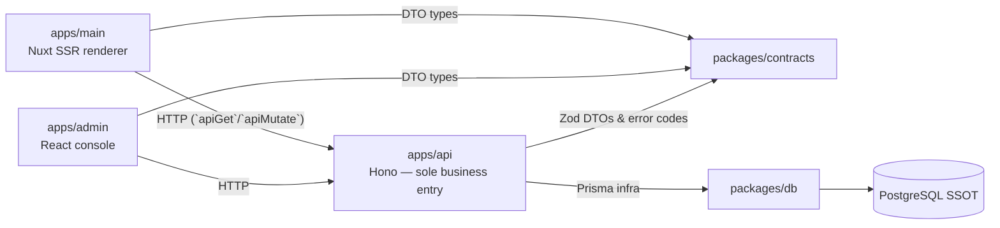

# Architecture

## System shape

Grey Flowers is a pnpm monorepo of five packages with one dependency spine: browser/rendering layers talk to a single business entry, which owns all database and business rules.

Package identity and the allowed-dependency matrix live in [PACKAGES.md](./PACKAGES.md). The authoritative design records are [四个项目的身份定位](../wiki/design/2026-08-01-four-project-roles.md) and the [后台运营工作流切片](../wiki/design/admin-operational-workflow-slices.md).

## Cross-cutting invariant

`Article.content` is always the raw Markdown/MDC text — it is the SSOT for authoring. Editors, preview, and migrations must never silently rewrite, lose, or downgrade MDC directives. `packages/contracts` never exports Prisma model types; a schema change is not a breaking change for callers.

## Migration state (complete)

All ops slices (music, activity, comments, users, overview) and all API resource migrations are delivered. `apps/main` has **no** direct Prisma access: every `server/api` route proxies the API through `apps/main/server/utils/api-gateway.ts` (`apiGet` read-only, `apiMutate` write/auth passthrough). The single remaining main-server file touching data is `server/routes/rss.xml.ts`, which reads published articles through the API's `/public/articles/list` (not Prisma).

## Directory responsibilities

### `apps/main` (Nuxt 4, `~` = `app/`, `#shared` = `shared/`, `#server` = `server/`, `~~` = app root)

- `app/` — Nuxt source: `app.vue`, pages, layouts, `components/` (`hana/` shared set, `prose/` MDC overrides), composables, plugins, Pinia `stores/`.
- `shared/` — runtime-neutral code for both the Nitro server and browser: `data/meta.ts`, types, `utils/`. Must not import Vue or server-only modules; stays Nuxt-local (no generic workspace shared package).
- `server/` — Nitro only. `utils/api-gateway.ts` (HTTP adapter to `apps/api`), `utils/markdown.ts` (MDC parsing, static-markdown whitelist), `routes/rss.xml.ts` (feed, now API-backed).

### `apps/api` (Hono, composition-root style)

- `src/env.ts` — validates all API env at startup, derives `ASSET_PUBLIC_URL`, `R2_ENDPOINT`, `R2_REGION`, auth origins/tokens.
- `src/bootstrap/dependencies.ts` — `createDependencies(env)` constructs and injects Prisma client, logger (`pino`), R2 adapter, and the service singletons. No module creates its own Prisma client.
- `src/app.ts` — `createApp(dependencies)`: global HTTP middleware (request id, logger, CORS), mounts modules, `onError(handleError)`, exports `AppType` (type-only).
- `src/main.ts` — `@hono/node-server` listen; process lifecycle only.
- `src/http/` — `errors.ts` (envelope + status mapping), `context.ts`, `middleware/` (`request-id`, `request-logger`, `require-principal`, `require-role`, `require-allowed-origin`).
- `src/lib/` — shared pure helpers across modules: `rate-limit.ts` (in-memory sliding window), `restricted-markdown.ts` (comment/activity sanitizer factory), plus pagination/markdown/parser/prisma utilities.
- `src/adapters/object-storage/` — R2 adapter; wraps real external I/O only, no permissions or business rules.
- `src/modules/` — vertical business modules, one per entity: `auth/`, `assets/`, `articles/`, `taxonomy/`, `comments/`, `activities/`, `music/`, `users/`, `overview/`. Each has `routes.ts` (thin: validate → call service → return mapped DTO), `service.ts` (queries, transactions, rules), `contracts.ts` (Prisma → DTO projections/mappers).

### `apps/admin` (React 19 + Vite + TanStack Router)

- `src/routes/route-tree.tsx` — TanStack Router definition + app shell (nav rail covering overview, activities, comments, users, music, assets, articles, taxonomy).
- `src/app/` — shell + `api/` client: `http.ts` (ky transport with envelope decode, bearer-token in memory, auth-refresh), `index.ts` (`ApiClient` + `apiClient` singleton), feature API clients (`articles.ts`, `assets.ts`, `auth.ts`, `taxonomy.ts`, …).
- `src/features/` — one folder per workflow: `overview/`, `activities/`, `comments/`, `users/`, `music/`, `assets/`, `articles/`, `taxonomy/`.
- `src/store/` — Zustand stores (auth, article editor, player) and React bindings.

## Boundaries

- Keep browser code out of any `server/`; do not import server-only modules into pages/components/stores.
- Extend HTTP/business capabilities in `apps/api` only. Do not add new Prisma-reading endpoints or business rules to `apps/main`.
- `apps/api` modules never read the raw `Event`/browser state; `http/` never carries queries or transactions.
- Do not hand-edit `packages/db/prisma/generated/` or `migration_lock.toml`; regenerate and commit intentional migration SQL (see [DATABASE.md](./DATABASE.md)).
- Build and formatting tooling differs by package — see [PACKAGES.md](./PACKAGES.md) and [BUILD.md](./BUILD.md).

## Deployment topology

`apps/main` is deployed from its checked-in artifact on pushing `master`. The VPS layout runs a PM2 process from `.output/server/index.mjs` on port 2408 (`apps/main/ecosystem.config.cjs`), reading deployment env declared on the server (not in-repo). The API and admin apps have dev/local run scripts but are not part of the deploy workflow. DB migrations are applied on the server separately (not by the deploy workflow).
