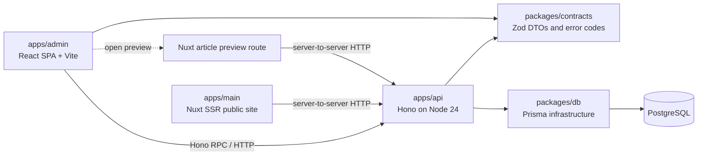

# Grey Flowers Admin 技术栈设计

## 状态与用途

- 决策日期：2026-08-01
- 状态：技术栈已确定，尚未开始创建 `apps/admin`、`apps/api` 或 `packages/contracts`
- 文档类型：架构参考与设计说明
- 读者：后续实现后台、API 和主站迁移的维护者

本文记录 Grey Flowers 新后台的既定技术栈、边界和取舍。它是后续实现的指导依据，不是本轮的实施清单；添加依赖、修改运行时代码、迁移数据访问或改变部署方式时，必须另行设计并验证。

当前仓库只有 `apps/main` 与 `packages/db`。`apps/main` 目前仍直接负责其服务端认证、查询和写入；本设计不追溯性地宣称这些迁移已经完成。

## 目标与不变条件

新后台服务于个人博客的日常运营，核心体验是：无论在手机、平板或桌面端，都能方便、安心、连续地编辑文章。技术栈优先服务于这个体验，而不是追求企业级流程的完整度。

目标状态如下：

1. `apps/admin` 是标准 React SPA，以编辑和运营为中心。
2. `apps/api` 是标准 Hono Node 服务，是业务数据查询、写入和操作的唯一应用入口。
3. `apps/main` 保留 Nuxt SSR、SEO、公开阅读体验和 MDC 渲染；它通过 API 获取业务数据，不再自行实施 Prisma 查询或写入。
4. `packages/db` 继续是 Prisma schema、迁移、生成客户端和数据库依赖的唯一所有者。
5. `Article.content` 始终以原始 Markdown/MDC 文本持久化。任何编辑器都不得静默改写、丢失或降级 MDC 指令。

这里的“API 为唯一 SSOT”指**业务数据访问与业务操作的唯一应用接口**。PostgreSQL 仍是持久化数据源，`packages/db` 仍只提供 Prisma 基础设施；它不是业务逻辑层，也不会对浏览器开放。

## 总体结构

`apps/main` 不能通过文件路径或 `@grey-flowers/db` 绕过 API 来取得业务数据。迁移期间可以分资源逐步切换，但每完成一个资源的迁移，主站与后台都应只调用该资源对应的 Hono 用例；不得长期保留双写或两套业务规则。

## Workspace 与包职责

| 位置                 | 包名                      | 责任                                                  | 明确不承担                                    |
| -------------------- | ------------------------- | ----------------------------------------------------- | --------------------------------------------- |
| `apps/admin`         | `@grey-flowers/admin`     | React SPA、编辑器、运营界面、调用 API                 | Prisma、数据库策略、MDC 的第二套渲染器        |
| `apps/api`           | `@grey-flowers/api`       | Hono 路由、认证与授权、业务用例、输入验证、读写编排   | 浏览器 UI、Prisma schema/迁移所有权           |
| `apps/main`          | `@grey-flowers/main`      | 公开站点 SSR、SEO、文章展示、Nuxt MDC 渲染            | 新的业务查询和写入实现                        |
| `packages/contracts` | `@grey-flowers/contracts` | Zod DTO、共享错误码、API 载荷边界                     | Prisma model/type、数据库查询、通用杂物收容站 |
| `packages/db`        | `@grey-flowers/db`        | Prisma schema、迁移、生成客户端、`createPrismaClient` | 请求、环境策略、授权、业务写入规则            |

不创建泛化的 `packages/ui` 或 `packages/shared`。后台的设计系统、组件和交互留在 `apps/admin`；只有已经被多个运行时稳定共享的 API 边界，才进入 `packages/contracts`。这可以避免在尚无真实复用前制造抽象层。

当 `apps/admin` 或 `apps/api` 真实创建时，才在 pnpm catalog 中加入其依赖分组；不提前放入“未来依赖”目录。根目录继续只负责 workspace 编排与跨包工具。

## 统一基础

| 主题           | 选择           | 约束与理由                                                                                                |
| -------------- | -------------- | --------------------------------------------------------------------------------------------------------- |
| 包管理与工作区 | pnpm workspace | 复用现有 monorepo 与 catalog 机制。                                                                       |
| Node 运行时    | Node 24        | API 与现有仓库保持同一运行时范围。                                                                        |
| 模块格式       | 纯 ESM         | 新包不得引入 CommonJS 兼容层或双模块产物。                                                                |
| TypeScript     | **6.0.3**      | 全仓唯一 SSOT 版本；Nuxt 当前不能使用 TypeScript 7，因此不允许通过双版本规避兼容性。                      |
| 工具函数       | `es-toolkit`   | 新工具需求首先使用它的现代 API；直接从 `es-toolkit` 导入，不使用 `es-toolkit/compat` 或 Lodash 兼容语义。 |
| 运行时校验     | Zod            | API 输入/输出 DTO 的边界校验；与 Hono validator 和 contracts 共用。                                       |

## API：Hono、Node 与构建链

### 运行时与依赖

`apps/api` 的基线是：

| 层次           | 选择                          | 用法                                                                   |
| -------------- | ----------------------------- | ---------------------------------------------------------------------- |
| HTTP 框架      | `hono`                        | 路由、中间件、错误映射与类型化应用接口。                               |
| Node 适配器    | `@hono/node-server`           | 在 Node 24 中启动 Hono。                                               |
| 输入校验       | `zod` + `@hono/zod-validator` | 在路由边界验证 params、query、headers 与 JSON body。                   |
| 类型化客户端   | Hono RPC（`hc`）              | 后台优先以应用导出的 API 类型调用；HTTP 仍是唯一运行时边界。           |
| 数据库基础设施 | `@grey-flowers/db`            | API 在组合根创建 Prisma client，业务用例不得触及生成客户端的文件路径。 |
| 工具函数       | `es-toolkit`                  | 复用纯函数工具，避免为集合、节流、对象处理重复造轮子。                 |

`packages/contracts` 中只放跨进程稳定的数据边界：DTO、枚举型错误码和必要的 Zod schema。不要从中导出 Prisma 类型；数据库结构不是 HTTP 合同。路由内部的认证、授权、事务与业务规则属于 `apps/api`。

### 开发、构建与交付

| 场景     | 选择                  | 说明                                                                                      |
| -------- | --------------------- | ----------------------------------------------------------------------------------------- |
| 本地开发 | `tsx`                 | 直接执行 ESM TypeScript，缩短 Hono 开发反馈；它不替代类型检查。                           |
| 类型检查 | `tsc --noEmit`        | 使用仓库唯一的 TypeScript 6.0.3。                                                         |
| 生产构建 | `tsdown`              | 输出 Node 可运行的 ESM，并生成 source map 与声明文件。                                    |
| 依赖处理 | external              | `@grey-flowers/db`、Prisma 与其运行时依赖必须保持外部依赖，不能被错误打入 server bundle。 |
| 启动     | Node 执行 `dist` 入口 | 具体监听、环境变量和部署载体另行决定。                                                    |

不在此阶段加入 OpenAPI 生成、容器化、队列、事件总线或第二个服务框架。实际出现外部消费者或独立文档需求时，再评估是否把 Hono 路由合同投影为 OpenAPI；在此之前，Hono RPC 与 Zod 足够支撑同仓库的主站和后台。

## Admin：React SPA 与编辑界面

### UI 基线

`apps/admin` 使用 React SPA + Vite，不采用 shadcn/ui。组件层选择 **React Aria Components + Tailwind CSS 4 + Lucide**：

| 层次                | 选择                         | 角色                                                                                                   |
| ------------------- | ---------------------------- | ------------------------------------------------------------------------------------------------------ |
| 构建与开发服务器    | Vite                         | 标准 React SPA 的开发与生产构建。                                                                      |
| UI 行为与无障碍语义 | React Aria Components        | 提供可访问的 dialog、menu、select、list、button 等交互基础；由项目自己塑造视觉，不套用模板化组件皮肤。 |
| 样式                | Tailwind CSS 4               | 用设计 token 与组合式样式建立一致布局和响应式规则。                                                    |
| 图标                | Lucide React                 | 保持轻量、一致且可按需使用。                                                                           |
| 桌面编辑布局        | `react-resizable-panels`     | 三栏编辑时可调整导航、编辑器与检查器的宽度。                                                           |
| 命令入口            | `cmdk`（出现真实命令需求时） | 用于文章跳转、发布、插入 MDC 等高频键盘操作，不预先做命令系统。                                        |

后台不是主站 UI 的复制品，而是 Grey Flowers 的 **Operate surface**：保留克制、温和的品牌气质，但把信息密度、焦点状态、连续编辑和触控效率放在第一位。

- 操作控件采用清晰的系统 sans-serif，减少阅读疲劳与平台违和感。
- 文章写作画布使用 Noto Serif SC，保证长文本的节奏。
- 状态、slug、日期、快捷键、字数等元数据使用 JetBrains Mono。
- 所有可触控交互的最小命中尺寸为 44px；hover 不能是唯一入口。
- React Aria 的键盘导航、焦点管理和 ARIA 语义是体验基线，视觉定制不能破坏它们。

### 状态边界

初始版本不引入全局状态库。状态按归属处理：

| 状态                               | 所在位置                                                |
| ---------------------------------- | ------------------------------------------------------- |
| API 数据、提交状态、失效与重新获取 | 数据请求层；需要缓存和失效协调时再引入专门的 query 库。 |
| 单个表单与编辑器草稿               | 当前页面/编辑器的局部状态。                             |
| 可分享的筛选、视图和文章定位       | URL。                                                   |
| 仅一次性覆盖层或短暂交互           | 对应 React 组件。                                       |

路由、query、表单库均不在现在预装。只有当原生方式出现已经证实的重复、缓存一致性问题或复杂校验负担时，才按“依赖准入规则”增加一个库；不得以“以后可能会用”为理由预先引入状态框架。

### 响应式编辑模型

同一篇文章、同一个草稿和同一组操作在不同尺寸上保持一致语义，改变的是排布而不是能力。

| 设备 | 默认布局                           | 高优先级交互                                                              |
| ---- | ---------------------------------- | ------------------------------------------------------------------------- |
| 桌面 | 可调整的导航 / 编辑器 / 检查器三栏 | 键盘快捷键、命令入口、固定保存状态、预览与元数据并行。                    |
| 平板 | 编辑器为主，检查器可收起           | 快速切换预览、标签、发布时间和状态。                                      |
| 手机 | 全屏编辑器                         | 底部主要操作、底部 sheet 承载元数据与插入工具，避免把桌面侧栏强塞进窄屏。 |

不为移动端维护第二个编辑器或另一套数据模型。断网草稿恢复、保存状态和发布权限必须在三种布局下表现一致。

## Markdown / MDC 编辑器

文章编辑是后台的核心能力，首版明确采用 **CodeMirror 6**，通过 `@uiw/react-codemirror` 等 React 绑定接入。启用 Markdown 语言支持、搜索、history、自动补全，并提供一个小型 Markdown/MDC 插入工具栏。

| 方面       | 决定                                                                                                   |
| ---------- | ------------------------------------------------------------------------------------------------------ |
| 持久化真相 | 原始 Markdown/MDC 字符串，即 `Article.content`。                                                       |
| 编辑模式   | CodeMirror 的源码编辑；工具栏只插入明确的 Markdown/MDC 片段，不重序列化全文。                          |
| 自动保存   | 使用 `es-toolkit/debounce` 合并短时间连续输入，再调用 API。                                            |
| 本地恢复   | `idb-keyval` 保存未确认写入的本地草稿；恢复提示必须让作者确认，不能静默覆盖服务端版本。                |
| 预览       | 最终通过 Hono 提供数据给 Nuxt 预览路由，复用主站 MDC 渲染，不在 admin 内建立第二套 Markdown renderer。 |

选择源码编辑不是退而求其次，而是内容模型的安全要求：现有 Nuxt 使用 `@nuxtjs/mdc` 解析原始正文。Milkdown、MDXEditor、Tiptap、BlockNote 等所见即所得编辑器可能改变嵌套、指令、属性或未识别语法，造成 MDC 文章无法无损往返。

未来若需要视觉编辑，可把 Milkdown 作为**可选视图**单独评估。它的准入前提是：以真实文章语料人工验证 Markdown/MDC 的编辑—保存—重新渲染往返，确认没有任一指令、属性、正文或格式被破坏；不满足即不接入，更不能取代源码编辑。

## 代码质量工具链

### 分区策略

| 范围                    | Linter            | Formatter        | 类型检查         |
| ----------------------- | ----------------- | ---------------- | ---------------- |
| `apps/main`             | 现有 Antfu ESLint | 保持现有格式策略 | Nuxt `typecheck` |
| `apps/admin`            | Oxlint            | Oxfmt            | `tsc --noEmit`   |
| `apps/api`              | Oxlint            | Oxfmt            | `tsc --noEmit`   |
| `packages/contracts`    | Oxlint            | Oxfmt            | `tsc --noEmit`   |
| `packages/db` 的手写 TS | Oxlint            | Oxfmt            | `tsc --noEmit`   |

根目录保留一个 `oxlint.config.ts`，以 workspace override 为不同包配置规则。它是新 React/Hono 相关代码的唯一 Oxlint 配置入口；不要在子 workspace 再创建一份 config。配置须排除构建产物、依赖目录、Prisma generated client 和迁移 SQL。

Oxfmt 同样只覆盖新的 React/Hono 相关 workspace；显式排除 `apps/main`，以免和 Antfu ESLint 的现有格式规则发生冲突。`packages/db/prisma/generated/` 与 migration SQL 不应被 Oxfmt 改写。

### 已定的取舍

- 使用原生 Oxlint 与 Oxfmt，不把 ESLint/Prettier 兼容层引进 admin/API。
- **暂不启用** Oxlint `typeAware`，也**不引入** `oxlint-tsgolint`。原因是全仓 TypeScript 固定为 6.0.3，而 Nuxt 侧当前不能采用 TypeScript 7；不以双 TypeScript 版本换取 lint 规则。
- 保留 `tsc --noEmit` 与 Nuxt `typecheck`，它们是类型正确性的来源；`tsx` 只能执行代码，不能代替它们。
- 当前不建立自动化测试体系：不添加 Vitest、Playwright、MSW、coverage、Husky 或 lint-staged。个人项目以类型检查、原生 lint、格式检查、构建和针对真实编辑流程的手动验收为质量门槛。

后续 package script 保持统一含义：每个新 workspace 提供 `build`、`typecheck`、`lint`、`format` 与 `format:check`；根目录继续负责串行编排。`pnpm lint` 必须同时覆盖 Nuxt 的 ESLint 与新包的 Oxlint，但两套规则互不侵入。

## 依赖准入规则

这个项目不追求“预装完整工具箱”。增加一个新库前，需要同时满足以下条件：

1. 它解决已经出现、且用现有栈会造成明显重复或体验缺口的问题。
2. 支持纯 ESM、Node 24、TypeScript 6.0.3，并能在 pnpm workspace 中清晰声明。
3. 不复制现有库能力，不引入第二套状态、表单、样式或 Markdown 真相来源。
4. 它的引入边界可局部化；不能为了一个页面的便利把全局架构改成框架约束。
5. 对编辑器相关库，还必须验证小屏触控、键盘可达性、草稿恢复，以及 MDC 内容不丢失。

`es-toolkit` 是默认的工具函数来源；只有它无法解决已证实需求时，才讨论新的小型工具库。任何待选库的负责人都是提出该依赖的实现任务；该任务需要在 PR/设计记录中写明需求、替代方案、包边界和移除成本。

## 明确不做的事

- 不把 shadcn/ui 作为后台组件基线。
- 不建立万能 `shared`、`ui`、状态管理或工具包。
- 不使用 WYSIWYG 编辑器作为 Markdown/MDC 的唯一或默认编辑器。
- 不为 Nuxt、admin 和 API 分别安装 TypeScript 版本。
- 不在 API 迁移前提前删除主站现有数据路径，也不允许迁移后继续以 Prisma 直连作为回退常态。
- 不在本设计阶段加入测试框架、覆盖率门槛、预提交钩子、OpenAPI 生成、队列或复杂部署基础设施。

## 后续实施前必须单独决策的事项

下列事项不是漏项，而是依赖真实用例的有意延后；它们由相应实施任务的设计记录负责，不能在编码中临时决定。

| 事项                                   | 触发时机                                      | 所有者         |
| -------------------------------------- | --------------------------------------------- | -------------- |
| API 的身份传播、会话与授权模型         | 第一个 admin 登录和第一个 main → API 调用之前 | API 实施设计   |
| API 错误 HTTP 映射、版本策略和上传协议 | 第一个可供主站/后台共用的资源 API 之前        | API 实施设计   |
| SPA 路由、query 缓存与复杂表单库       | 原生局部状态首次无法清晰满足具体页面时        | Admin 实施设计 |
| 草稿冲突解决、离线重试与版本快照       | 自动保存接入真实文章写入之前                  | 编辑器实施设计 |
| API、admin 的部署、域名与预览环境      | 第一次可部署构建之前                          | 交付实施设计   |

这些决策不得改变本文已经确定的核心边界：API 是业务数据访问入口，MDC 原文是文章真相，`packages/db` 是 Prisma 所有者，且全仓只使用 TypeScript 6.0.3。

## 实施完成后的最小验收

本文不引入测试框架。每个后续实现阶段至少应保留以下证据：

1. `pnpm typecheck`、`pnpm lint`、新包的 `format:check` 和 `pnpm build` 成功。
2. 后台可在桌面、平板和手机尺寸完成一次新建、连续编辑、自动保存、刷新恢复与发布前检查。
3. 包含真实 MDC 指令的文章经编辑、保存和 Nuxt 预览后，原文与渲染均无意外改变。
4. 主站与后台针对已迁移资源只经 API 访问；源码搜索不再发现该资源的主站 Prisma 读写实现。

## 与 workspace foundation 的关系

本文以 [_notes/grey-flowers-admin/plans/2026-08-01-pnpm-workspace-foundation.md](../plans/2026-08-01-pnpm-workspace-foundation.md) 为前置约束。foundation 负责建立 `apps/*`、`packages/*` 和 `packages/db` 的边界；本文只定义随后创建 admin/API 时应采用的技术方向。二者都不授权直接修改数据库 schema、迁移、生产部署或现有主站行为。
