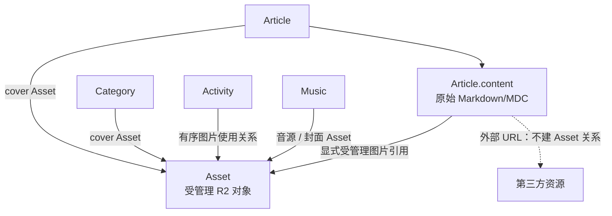

# Grey Flowers Asset Schema 初步设计

## 状态与用途

- 决策日期：2026-08-01
- 状态：领域方向已确认；Prisma schema 与迁移正在实施，R2 Adapter 与上传接口尚未创建
- 文档类型：架构参考与初步领域设计
- 读者：后续设计 Asset schema、Hono Asset 模块、Admin 上传体验与主站渲染的维护者

本文记录 Grey Flowers 对受管理 R2 资产的初步建模方向。它解决当前仅保存 URL、无法表达资产身份、引用关系、清理与恢复的问题，并为后续 schema 和接口设计提供共同词汇。

本文不是可执行的 Prisma 设计或迁移计划。它不确定具体字段名、ID 类型、枚举值、索引、上传协议、MDC 语法实现、R2 bucket 拓扑或历史数据迁移步骤。任何此类变更均须单独设计、验证并取得实施授权。

本文以前置的 [Admin 技术栈设计](./2026-08-01-admin-technology-stack.md)、[四个项目的身份定位](./2026-08-01-four-project-roles.md) 和 [Hono Backend 架构设计](./2026-08-01-hono-backend-architecture.md) 为约束。

## 已确认的 schema 决定

- 所有后台受管理的上传对象写入同一个受控 R2 bucket；`storage key` 在该 bucket 内全局唯一。对象 key 的目录前缀由服务端上传用途选择，例如 `article-covers/`、`category-covers/` 与 `music/`，不作为 Asset 的媒体类型或唯一使用角色。
- R2 上传和对象元数据确认成功后才创建 Asset 记录。上传失败不持久化 Asset；R2 写入成功但数据库创建失败的孤儿对象由上传用例补偿删除或后续清理。
- 已持久化的生命周期仅包含可关联、待清理与已删除状态。文件类型仍只区分图片和音频；封面、正文插图与音源等使用位置由明确外键或关联表表达。

## 问题与目标

当前 schema 将文章封面、分类封面、动态图片、音乐音源和音乐封面表示为 URL 或 URL 数组。URL 能完成渲染，却不足以回答以下问题：

- 一个 R2 对象是否由博客拥有、如何定位及由谁上传？
- 它被哪些文章、分类、动态或音乐记录使用？
- 解除一个引用后能否删除对象，是否仍有其他引用？
- 如何安全处理直接粘贴 Markdown 时出现的第三方图片？

因此引入 `Asset` 的目标是让博客拥有的 R2 对象成为可追踪、可复用、可恢复的持久化对象，同时保留 Markdown/MDC 对任意外部 URL 的表达能力。

## 术语与领域边界

| 术语 | 定义 | 不是 |
| --- | --- | --- |
| **Asset** | 由博客管理的一个 R2 对象及其元数据、状态和身份记录 | 任意字符串 URL，也不是浏览器中的 `File` 对象 |
| **storage key** | R2 对象在受控 bucket 中的稳定定位 | 可随 CDN 域名变化的公开 URL |
| **delivery URL** | 供页面渲染或下载的公开地址 | Asset 所有权或引用关系的唯一依据 |
| **Asset 使用关系** | Asset 被某个领域对象以特定角色引用的持久化关系 | Asset 本体，也不决定文件的 MIME 类型 |
| **受管理 Markdown 引用** | 正文中明确指向一个 Asset 的图片引用 | 所有 Markdown 图片 |
| **外部内容引用** | 正文中指向第三方 URL 的图片或其他资源 | 博客拥有的 Asset 或可自动清理的对象 |

“分类封面”在本文中指现有 `Category.cover` 的使用场景；它不是文件系统目录。

## 核心建模原则

1. **Asset 身份与 URL 分离。** Asset 的稳定身份来自数据库记录与 storage key；delivery URL 是可替换的投递信息。
2. **文件类型与使用角色分离。** 图片和音频是 Asset 的媒体类型；文章封面、正文插图、动态配图、音乐音源等是使用角色。同一个图片可以在多个位置被复用。
3. **正文原文优先。** `Article.content` 保持原始 Markdown/MDC。正文图片的关系记录用于追踪与清理，不能成为第二份正文真相。
4. **外部引用合法且无所有权。** 粘贴的第三方图片保留原 URL，不创建 Asset，不下载、不代理、不静默改写。
5. **引用必须可证明。** 不通过“URL 看起来像 R2 地址”猜测 Asset 归属；受管理引用必须携带明确身份并可验证。
6. **删除以引用安全为前提。** 解除一个使用关系不等于删除 R2 对象。对象只有在没有有效引用、经过保留策略后才可清理。

## Asset 类型与使用角色

首版需要覆盖的使用角色如下。它们描述 Asset 的使用位置，不预先要求成为最终 enum 名称。

| 使用角色 | Asset 媒体类型 | 当前 URL 字段 | 关系方向 |
| --- | --- | --- | --- |
| 文章正文插图 | 图片 | `Article.content` 内的 Markdown URL | 文章与 Asset 的多对多引用索引 |
| 文章封面 | 图片 | `Article.cover` | 文章到单个 Asset 的显式关联 |
| 分类封面 | 图片 | `Category.cover` | 分类到单个 Asset 的显式关联 |
| 动态配图 | 图片 | `Activity.images` | 动态到多个有序 Asset 的关联 |
| 音乐音源 | 音频 | `Music.src` | 音乐到单个 Asset 的显式关联 |
| 音乐封面 | 图片 | `Music.cover` | 音乐到单个 Asset 的显式关联 |

Asset 自身至少需要表达以下信息类别，具体字段设计后定：

- 身份与位置：Asset ID、storage key、受控存储位置；
- 媒体元数据：图片/音频类型、MIME、字节大小，以及适用时的尺寸或时长；
- 生命周期：创建、上传确认、可用、待清理和删除后的状态；
- 审计：创建者和创建时间；
- 投递：由当前存储配置推导或记录的 delivery URL。

内容哈希、去重、转码版本、缩略图和保留期均是可能的未来能力，当前不因“也许会用”而进入必选 schema。

## 初步关系方向



关系设计优先使用可由数据库约束的明确外键和关联表：

- 单值使用，例如文章封面、分类封面、音乐音源与音乐封面，应以所属实体到 Asset 的明确关系表达；
- 多值且有顺序的动态图片应使用带顺序信息的关联表；
- 文章正文图片应使用文章与 Asset 的关联索引，例如概念上的 `ArticleInlineAsset`。正文中的顺序和替代文本仍以 Markdown 为准；关联索引只记录已确认的受管理引用；
- 不采用泛化的 `ownerType + ownerId` 多态表作为唯一关联方案，因为它无法由数据库外键验证所有者存在性。

精确的 relation 名称、基数、唯一约束及是否需要独立的引用账本，留给 schema 专项设计决定。

## Markdown/MDC 与外部图片

直接粘贴 `.md` 是受支持的写作方式。正文中出现第三方图片时，编辑器和 API 应将其识别为外部内容引用：原文保持不变、可以发布、不会生成 Asset 记录，也不会被 R2 清理流程触及。

对于由后台上传并插入正文的图片，编辑器应插入带明确 Asset 身份的受管理引用。候选语义如下：

```md
{asset-id=123}
```

此处的 `asset-id` 只是候选表示，不是已批准的 MDC 语法。实现前必须以真实文章验证 `@nuxtjs/mdc` 能够无损编辑、保存、解析与渲染该属性；若不兼容，应单独选择等价的受管理 MDC 表示，不能悄悄改写现有内容。

保存文章时，API 应使用语法感知解析器而非正则表达式提取受管理引用，并在文章写入的同一事务中同步正文引用索引。处理规则如下：

- 明确的受管理引用必须解析到存在且可用的 Asset；身份与可见 URL 不一致时应失败，而不是猜测；
- 纯外部 URL、代码块中的示例 URL 和未标识的历史 URL 不创建 Asset 关系；
- 已知 R2 域名但没有明确身份的 URL 视为未管理引用，不能反向猜测对应的 Asset；
- 若作者希望将外部图片纳入博客资产库，必须显式触发“导入”操作，确认预览后才替换该处 URL。下载流程还须具备 SSRF 防护与文件校验。

## R2 生命周期与安全边界

R2 是 Asset 的对象存储 Adapter，不是浏览器直接管理的第二个数据源。Hono 负责授权、用途限制、文件校验、Asset 记录和使用关系；浏览器不持有 R2 凭证，也不能指定任意 bucket、目录或 object key。

概念上的生命周期如下：

```text
创建待确认 Asset → 上传 R2 → 确认对象与元数据 → 可关联的 Asset
→ 解除所有使用关系 → 待清理 → 删除 R2 对象并记录删除结果
```

是否采用 API 代理上传或预签名直传尚未决定。无论哪种协议，只有确认成功的 Asset 才能关联到文章、分类、动态或音乐；数据库与 R2 之间没有分布式事务，因此失败、孤儿对象和清理重试必须在后续上传设计中被明确处理。

## 四个项目的职责

| 项目 | Asset 相关职责 | 明确不承担 |
| --- | --- | --- |
| `packages/db` | Asset 和使用关系的 Prisma schema、迁移、生成客户端 | R2 凭证、文件上传、权限和业务清理策略 |
| `apps/api` | Asset 用例、授权、校验、R2 Adapter 调用、引用一致性与清理决策 | 浏览器上传 UI 或第二套 MDC 渲染 |
| `apps/admin` | Asset 库与上传交互、在实体编辑页选择/插入已管理 Asset、提示外部引用 | 直接访问 R2、推断或维护数据库关系 |
| `apps/main` | 使用 API DTO 渲染可公开的 Asset URL 和文章内容 | Prisma、R2 凭证、Asset 管理与引用修复 |

## 迁移与兼容性原则

当前 URL 字段和文章正文不能被一次性替换。后续实施应遵守以下原则：

1. 先增加新模型与关系，再让新的上传和编辑路径写入 Asset；
2. 历史正文与外部 URL 保持可读，不进行静默批量重写；
3. 仅在有已验证 storage key 和明确所有者映射时回填受管理资产，不能凭 URL 反查或猜测；
4. 在主站和后台均通过 API 消费新关系、并完成可恢复的迁移验证前，不删除原有 URL 读取路径；
5. 删除历史 URL 字段或 R2 对象前，必须证明没有遗留引用，并保留恢复策略。

## 后续必须单独决策的事项

下列问题是本设计的有意延后，不应在编码时临时决定：

- `Asset` 的具体 Prisma 字段、ID 策略、状态枚举、索引、唯一约束与审计关系；
- 单值关系、关联表和正文引用账本的精确 schema；
- 受管理 Markdown/MDC 语法及其在 Nuxt 渲染链中的兼容性证据；
- API 代理上传与预签名直传的选择、大小/MIME 限制、图片处理与音频元数据解析；
- 孤儿对象、失败上传、软删除、保留期、恢复和 R2 清理任务；
- Asset 重用、去重、替换、并发编辑与引用删除的冲突策略；
- 外部资源导入的权限、SSRF 防护、版权确认与失败反馈；
- Asset 管理页、编辑器插入体验和公开投递域名。

这些决策完成前，本文只授权继续进行设计讨论；不授权 schema、R2、内容数据或生产环境的实际变更。
