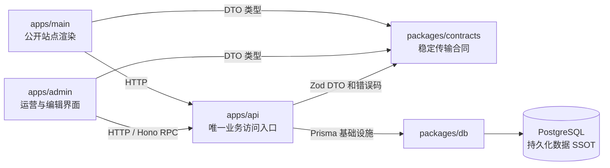

# Grey Flowers 四个项目的身份定位

## 状态与用途

- 决策日期：2026-08-01
- 状态：架构定位已确定；`apps/admin`、`apps/api` 和 `packages/contracts` 尚未创建
- 文档类型：架构参考与设计说明
- 读者：后续实现后台、API、主站迁移和数据库变更的维护者

本文固化 Grey Flowers 四个项目的职责边界、允许依赖和不变约束。它回答“某项能力应属于哪里”，不是实施清单；创建 workspace、迁移接口、变更 schema、选择认证或部署方案，仍须由相应设计和实施任务单独授权。

本文以 [Admin 技术栈设计](./2026-08-01-admin-technology-stack.md) 为前置约束。发生冲突时，以该文档已经确定的技术栈、内容模型和依赖准入规则为准。

## 术语

- **持久化数据 SSOT**：PostgreSQL 是业务数据的最终事实来源。
- **业务访问入口**：`apps/api` 是所有业务数据读取、写入和业务操作的唯一应用入口。调用者不得绕过它直接访问数据库。
- **Prisma 基础设施**：`packages/db` 只拥有 schema、迁移和客户端创建能力；它不是业务层，也不是浏览器可访问的接口。
- **业务后端逻辑**：认证与授权、输入和输出校验、事务、查询策略、业务规则、写入编排、媒体记录等会改变业务结果的代码。
- **渲染逻辑**：公开页面的 SSR、SEO、MDC 解析和展示。它不拥有业务规则，只消费 API 返回的数据。

因此，“API 是唯一 SSOT”在本文中一律指**业务访问与操作的唯一应用入口**，不表示 Hono 自己持有持久化数据。

## 总体关系

`packages/contracts` 是跨进程合同，不属于本文“四个项目”的业务身份之一；它在实际创建后只承载稳定的 Zod DTO、错误码和必要的传输类型。

## 身份定位

| 项目 | 核心身份 | 应承担 | 明确不承担 |
| --- | --- | --- | --- |
| `apps/admin` | 唯一的博客运营与数据管理可视化界面 | 内容编辑、发布流程、媒体与音乐管理、运营状态和对 API 的调用；在桌面、平板、手机提供一致操作语义 | Prisma、数据库直连、认证授权规则、事务、第二套 MDC 渲染器或业务规则副本 |
| `apps/api` | 唯一的业务数据访问与操作入口 | Hono 路由、认证授权、Zod 校验、错误映射、业务用例、事务和对 `packages/db` 的读写编排 | 浏览器 UI、Prisma schema/迁移所有权、将数据库模型原样暴露为 HTTP 合同 |
| `apps/main` | 公开博客的 Nuxt 渲染层 | SSR、SEO、公开阅读体验、MDC 渲染、基于 API 数据的页面和预览 | Prisma 查询或写入、自己的业务 API、认证授权规则、邮件或媒体等业务副作用 |
| `packages/db` | Prisma 持久化基础设施所有者 | schema、迁移、生成客户端、`createPrismaClient` 和 Prisma 依赖 | HTTP、环境策略、请求上下文、权限、查询策略、业务写入规则 |

### `apps/admin`：Operate surface

后台是博客数据管理的唯一可视化工作台。它的成功标准不是“可以查看数据”，而是让发布动态、编辑文章和上传音乐等日常流程轻量、可靠且优雅。

后台通过 `apps/api` 提交意图和读取状态；它不得根据 Prisma model 推断业务规则，也不得为便利在浏览器实现第二套发布、权限、内容转换或媒体记录逻辑。文章编辑以原始 Markdown/MDC 文本为真相，预览复用 `apps/main` 的最终渲染能力。

### `apps/api`：业务深模块

API 将认证、授权、校验、查询策略、事务和领域规则收敛在一个对调用者足够小的接口之后。Admin 和主站只需要知道稳定的 HTTP/Zod 合同、错误码和调用前置条件，不需要知道 Prisma schema、数据库关系或事务安排。

每个 Hono 用例必须同时拥有明确的输入、成功输出和失败输出合同。`packages/contracts` 不导出 Prisma model/type；数据库结构改变不应自动成为外部调用者的破坏性变更。

直接上传对象存储可以在未来作为数据传输优化存在，但不构成绕过 API：上传授权、文件校验和媒体记录仍由 API 的业务用例负责。

### `apps/main`：公开渲染层

主站通过 API 取得业务数据，并负责将文章和公开信息渲染为可索引、可阅读的 Nuxt 页面。它可以在 SSR 阶段服务器到服务器地调用 API，也可以在需要浏览器交互时调用 API；两种方式都不得回退到 Prisma 或自有业务端点。

“移除主站后端逻辑”不等于移除 Nuxt 的 SSR/Nitro 运行时。主站不得保留 `server/api`、Prisma 组合根、认证中间件或业务工具；若公开输出在技术上需要极薄的服务端渲染适配，例如动态 RSS，它只能调用 API 并格式化公开表示，不能重新实现查询、授权或业务规则。

### `packages/db`：窄的持久化基础设施模块

数据库包是 Prisma 的唯一所有者。它向 API 提供创建客户端所需的基础设施，并保持 schema、迁移和生成产物的一致性。

只有 `apps/api` 可以在应用运行时依赖它。`apps/main`、`apps/admin` 和浏览器代码均不得导入 `@grey-flowers/db`，也不得通过文件路径访问生成客户端。

## 允许的依赖与数据流

| 调用方 | 允许调用 | 原因 |
| --- | --- | --- |
| `apps/admin` | `apps/api` 的 HTTP/Hono RPC 合同、`packages/contracts` | 后台只通过业务入口读取和操作数据。 |
| `apps/main` | `apps/api` 的 HTTP 合同、`packages/contracts` | 主站只消费业务数据并完成公开渲染。 |
| `apps/api` | `packages/contracts`、`packages/db` | API 解释传输合同并编排持久化基础设施。 |
| `packages/db` | Prisma 与数据库驱动依赖 | 保持为无业务语义的底层模块。 |

下列路径一律禁止：

- `apps/admin` 或 `apps/main` → `packages/db`；
- 浏览器 → PostgreSQL 或 Prisma；
- `apps/main` → 自有的业务 `server/api` → Prisma；
- `apps/admin` → 自己的一套数据库模型、发布规则或 MDC 渲染真相；
- `packages/db` → HTTP、身份、环境或业务模块。

## 跨项目不变约束

1. 任何已迁移资源的业务读写只经过 API；主站和后台不得长期保留双写或两套业务规则。
2. `Article.content` 始终以原始 Markdown/MDC 文本保存。编辑器、预览与迁移不得静默改写、丢失或降级 MDC 指令。
3. API 合同以 Zod DTO 和错误码表达；Prisma type 不是跨项目合同。
4. Admin 的操作体验可以因屏幕尺寸调整布局，但草稿、保存、权限和发布的语义必须一致。
5. 新的共享包只在已有稳定、跨运行时复用的事实下创建；不得以预期复用为由建立泛化的 `shared`、`ui` 或状态包。
6. 认证、授权、上传、并发冲突和错误 HTTP 映射属于 API 的职责，但其具体协议须先完成专项设计，不能在页面实现中临时决定。

## 迁移规则

当前 `apps/main` 仍拥有其服务端认证、查询和写入实现；本定位不追溯性地宣称迁移已经完成。后续迁移必须以资源为单位完成闭环：

1. 为一个资源定义稳定的 DTO、错误码和 Hono 用例；
2. 由 API 实现并验证该用例的读取或写入规则；
3. 让主站和后台改为只调用该用例；
4. 验证 SSR、浏览器交互和相关公开表示；
5. 删除该资源遗留的主站 Prisma 访问和业务端点。

迁移前不得提前删除主站现有路径；迁移完成后不得把旧路径保留为常态回退。若发现合同不足、权限语义不明或需要双写才能继续，应停止该资源迁移并补充设计，而不是在调用方复制规则。

## 本文不决定的事项

以下事项已经明确归属，但尚未选择具体方案：

- Admin、主站 SSR 和主站浏览器调用 API 时的身份传播、会话、CORS 与 CSRF；
- API 的错误 HTTP 映射、版本策略和上传协议；
- 编辑器自动保存的并发前置条件、冲突解决、离线重试与版本快照；
- Admin 路由、查询缓存、表单库和部署拓扑；
- 首个资源及其迁移顺序。

这些后续决策不得改变本文的核心定位：API 是唯一业务访问入口，主站是公开渲染层，后台是唯一运营界面，数据库包是 Prisma 基础设施所有者。
