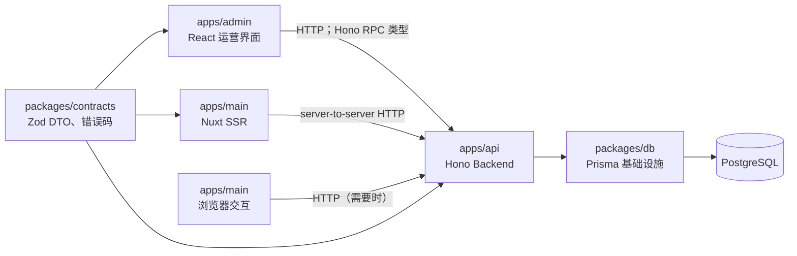
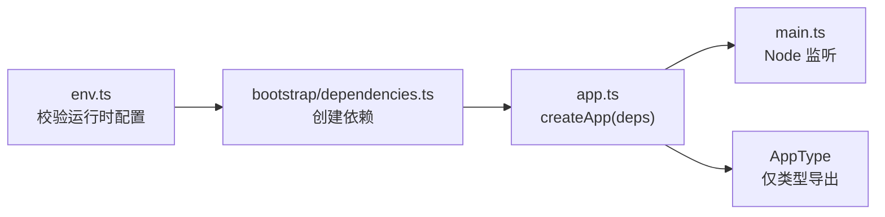

# Grey Flowers Hono Backend 架构设计

## 状态与用途

- 决策日期：2026-08-01
- 状态：整体架构已确定；`apps/api` 与 `packages/contracts` 尚未创建
- 文档类型：架构参考与设计说明
- 读者：后续实现 API、Admin、主站迁移和交付的维护者

本文定义 `apps/api` 作为 Hono Backend 的整体组合方式、目录骨架、依赖方向和跨项目 Interface。它帮助维护者判断代码属于哪里、调用能否跨越既定 seam，以及新增能力何时需要专项设计。

本文不定义任何实体模块的路由、用例、DTO、Prisma schema、上传/Asset 模型或页面行为。它不授权创建 package、添加依赖、迁移主站端点、修改数据库或部署 API。

本文以 [Admin 技术栈设计](./2026-08-01-admin-technology-stack.md) 与 [四个项目的身份定位](./2026-08-01-four-project-roles.md) 为前置约束。发生冲突时，前者的技术选型和后者的跨项目职责优先。

## 架构目标与不变条件

Hono Backend 是 Grey Flowers 唯一的**业务数据访问与业务操作入口**。它将认证授权、输入输出校验、查询策略、事务和业务规则收敛在同一个应用中；Admin 与主站只通过其稳定的 HTTP/Zod 合同读取数据或提交意图。

以下事实不因 Hono 的引入而改变：

1. PostgreSQL 是持久化数据的 SSOT；Hono 不是数据源。
2. `packages/db` 是 Prisma schema、迁移、生成客户端和客户端工厂的唯一所有者；它不包含业务规则。
3. `Article.content` 是原始 Markdown/MDC 文本。Hono 提供原文和业务数据，`apps/main` 保留最终 MDC 渲染。
4. `apps/api` 是唯一可在应用运行时依赖 `@grey-flowers/db` 的应用。
5. 新旧数据路径按资源迁移，不允许长期双写或并行维护两套业务规则。

## 系统中的位置



Hono RPC 只提供 TypeScript 调用便利；实际运行时边界仍是 HTTP。Admin 可使用 API 导出的类型创建 `hc` 客户端；主站以 HTTP 和 `packages/contracts` 消费数据，不导入 API 的运行时代码，也不导入 Prisma。

Hono 不拥有浏览器 UI、MDC 的第二套渲染器或数据库迁移。对象存储等外部系统若被引入，只能经 API 内部 Adapter 调用；其授权、文件校验、记录与业务结果仍由 API 负责。

## 应用组合与运行时

Hono 应保持为可组合的应用模块，而非由路由文件隐式启动的全局进程。启动、组合和业务实现各自只有一个职责：



| 位置 | 职责 | 不应承担 |
| --- | --- | --- |
| `env.ts` | 在启动时读取并验证 API 所需环境变量 | 在请求处理或业务模块中散落读取 `process.env` |
| `bootstrap/dependencies.ts` | 创建 Prisma client 和已批准的外部 Adapter，并组装 `AppDependencies` | 路由定义、业务规则或 Node 监听 |
| `app.ts` | `createApp(deps)`、安装全局 HTTP 能力、挂载模块、导出 Hono 类型 | 打开端口、创建隐式全局依赖 |
| `main.ts` | 使用 `@hono/node-server` 启动 Node 进程并处理进程生命周期 | 路由、查询或业务编排 |

依赖必须从组合根显式传入 `createApp(deps)`。模块不创建自己的 Prisma client，也不依赖隐藏的进程单例；这让应用实例的配置、验证和替换位置保持局部可见。

## 顶层目录骨架

`apps/api` 采用按业务模块纵切的目录，而不是全局 `controllers/`、`services/`、`repositories/` 横切目录。下列骨架是稳定约束；`modules/` 下的实体清单、每个模块的文件和接口在对应专项设计中决定。

```text
apps/api/
├── src/
│   ├── main.ts                 # Node 启动入口
│   ├── app.ts                  # createApp(deps) 和 AppType
│   ├── env.ts                  # 环境校验
│   ├── bootstrap/
│   │   └── dependencies.ts     # Prisma 与 Adapter 组合根
│   ├── http/
│   │   ├── context.ts          # 请求上下文与 Principal 类型
│   │   ├── errors.ts           # 已知错误的统一 HTTP 映射点
│   │   └── middleware/         # 认证、授权、请求横切能力
│   ├── adapters/               # 已获批准的外部系统实现
│   │   └── object-storage/     # 仅在上传设计确定后创建
│   └── modules/                # 以 Prisma 实体为主轴的业务模块
├── package.json
├── tsconfig.json
└── tsdown.config.ts
```

`modules/` 中的模块以领域实体和已证实的业务能力为主轴。实体模块具备其管理所需的 CRUD 基线，并在同一模块内拥有该实体的发布、合并、回复、关联等业务操作；不因追求“纯 CRUD”将规则推给 Admin 或 Main。关系、投影和上传能力的具体归属由后续模块与 Asset 设计确定。

`adapters/` 只封装有真实外部差异的基础设施，例如 R2。Adapter 不定义 HTTP 载荷、权限或业务流程；这些仍属于调用它的 Hono 模块。没有第二个 Adapter 时，不提前建立泛化的 repository、storage interface 或 shared package。

## Interface 与 contracts

`packages/contracts` 是跨进程稳定 Interface 的唯一共享位置。每个 Hono 用例必须具备：

1. Zod 定义的 params、query、headers 或 JSON body 输入；
2. 明确的成功 DTO；
3. 可被调用方处理的错误码和失败 DTO；
4. 不依赖 Prisma model、Prisma input type 或数据库字段命名的传输语义。

Hono 路由使用 `@hono/zod-validator` 在 HTTP 边界解析不可信输入。业务模块在返回前将数据库记录映射为 DTO；不得把 Prisma 查询结果原样作为跨进程合同。输出 schema、错误 HTTP 格式和版本策略属于后续 API 合同设计，不能在不同模块中各自决定。

`app.ts` 导出的 Hono `AppType` 仅用于 Admin 的类型化客户端。应以 type-only 方式向消费者暴露，避免把 Node、Prisma 或 API 运行时代码打入浏览器。Hono RPC 不是第二种传输协议，也不替代 `packages/contracts` 的稳定 DTO。

## HTTP 横切能力与模块职责

Hono 的 HTTP 层只负责 transport 适配和横切能力；业务模块负责业务结果。职责如下：

| 责任 | 所在位置 |
| --- | --- |
| 解析 HTTP、安装路由、请求上下文、输入验证 | `http/` 与模块路由适配层 |
| 认证、授权和 Principal 写入请求上下文 | `http/middleware/` 与身份相关模块 |
| 已知错误到 HTTP 错误合同的映射 | `http/errors.ts` |
| 查询策略、事务、状态迁移、关系一致性 | 对应业务模块 |
| Prisma 查询 projection 与 DTO 映射 | 对应业务模块的私有实现 |
| R2 等外部 I/O | `adapters/`，由业务模块调用 |

路由函数保持薄：验证输入、调用模块、返回已经映射的 DTO。它们不得承载 Prisma 查询、跨资源事务、权限例外或内容转换。反之，业务模块不得读取原始 HTTP Event，也不得依赖浏览器/UI 状态。

公开读取与管理操作是不同的 Interface。前者只提供允许公开的已发布数据；后者要求适当的 Principal 并可返回草稿或运营信息。两者可以复用模块内部规则，但不能通过调用方自行过滤敏感字段来共用同一对外 DTO。

## 依赖方向与禁止路径

允许的依赖方向为：

```text
main.ts → app.ts → http/、modules/
bootstrap/ → @grey-flowers/db、已批准的 adapters
http/、modules/ → @grey-flowers/contracts
modules/ → 经注入的 Prisma 与 Adapter 能力
@grey-flowers/contracts、@grey-flowers/db → 不依赖应用模块
```

下列依赖一律禁止：

- `apps/api` 导入 `apps/admin` 或 `apps/main` 的运行时代码；
- `apps/main`、`apps/admin` 或浏览器代码导入 `@grey-flowers/db`；
- `packages/contracts` 导入 Prisma、Hono、Node 或任意应用模块；
- Adapter 反向调用业务模块，或自行解释用户权限；
- 业务模块通过文件路径读取 Prisma generated client；
- 为单一调用者预建 `shared`、`repository` 或通用业务工具包。

## 构建、质量与交付

API 使用 Node 24、纯 ESM 和仓库唯一的 TypeScript 6.0.3。`tsx` 用于本地执行，`tsc --noEmit` 是独立类型检查，`tsdown` 输出可由 Node 执行的 ESM、声明文件与 source map。Prisma、`@grey-flowers/db` 及其运行时依赖保持外部依赖，不被错误打入 server bundle。

新 workspace 创建后，应提供 `build`、`typecheck`、`lint`、`format` 与 `format:check`，并由根目录稳定命令编排。API 使用根目录的 Oxlint/Oxfmt 配置；不修改 `apps/main` 既有的 Antfu ESLint 格式策略。

每个资源的迁移遵循同一闭环：先定义合同和 Hono 用例，再迁移 Admin/Main 调用方，验证 SSR 与浏览器行为，最后删除该资源遗留的主站 Prisma 读写与业务端点。不存在常态回退的双写路径。

## 后续必须单独设计的事项

本文刻意不决定下列问题：

- Prisma 实体到 Hono 模块的完整清单、各模块 CRUD 与业务操作；
- Asset schema、R2 上传协议、对象生命周期和外部 Markdown 图片处理；
- 认证、会话、CORS、CSRF、Principal 结构和管理员授权规则；
- 路由命名、HTTP 版本策略、错误响应格式与状态码细则；
- 草稿保存的并发前置条件、冲突处理、离线恢复与版本快照；
- Admin 的具体页面、路由、缓存和表单策略；
- 部署拓扑、域名、预览环境与监听配置。

这些设计必须遵守本文的组合和依赖约束，但不得在实现时临时推断。若其中任一决策要求修改 schema、迁移、R2 或生产部署，应先取得对应的实施授权。
