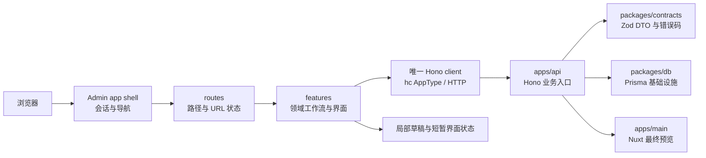

# Grey Flowers React Frontend 架构设计

## 状态与用途

- 决策日期：2026-08-01
- 状态：整体架构已确定；`apps/admin` 尚未创建
- 文档类型：架构参考与设计说明
- 读者：后续实现 Admin、Hono API、主站迁移和交付的维护者

本文定义 `apps/admin` 作为 React Frontend 的整体分层、目录骨架、页面边界和跨项目协作方式。它帮助维护者判断一项浏览器代码属于哪里、何时可以复用，以及页面是否越过 API 的业务边界。

本文不选择具体路由、请求缓存或表单库；不定义任何实体的 DTO、路由、Prisma schema、认证协议、上传协议或编辑器并发细则。它不授权创建 workspace、添加依赖、修改数据库、迁移主站端点或部署服务。

本文以前置的 [Admin 技术栈设计](./2026-08-01-admin-technology-stack.md)、[四个项目的身份定位](./2026-08-01-four-project-roles.md) 和 [Hono Backend 架构设计](./2026-08-01-hono-backend-architecture.md) 为约束。发生冲突时，以这些文档已确定的技术选型、跨项目职责和 API 组合方式为准。

## 架构目标与不变条件

Admin 是 Grey Flowers 唯一的运营与数据管理可视化工作台。它应让文章编辑、发布、媒体管理和日常运营在桌面、平板与手机上保持一致的业务语义；响应式变化只改变布局，不创造第二套页面逻辑或数据模型。

以下事实不因 React Frontend 的引入而改变：

1. PostgreSQL 是持久化数据的 SSOT；`packages/db` 的 Prisma schema 是持久化模型和迁移的唯一所有者。
2. `apps/api` 是业务数据读取、写入与业务操作的唯一应用入口；Admin 不导入 Prisma，也不根据数据库关系推断业务规则。
3. `Article.content` 是原始 Markdown/MDC 文本。Admin 编辑原文，`apps/main` 保留最终 MDC 渲染；Admin 不建立第二套 Markdown 渲染真相。
4. 已迁移资源只能通过 API 访问，不保留 Admin 的数据库直连、双写或业务规则副本作为常态回退。
5. 不创建泛化的 `packages/ui`、`packages/shared`、全局状态包或万能工具目录。

## 三种事实来源

“以 Prisma 领域模型设计页面”与“以 Hono API 作为接口 SSOT”适用于不同层次，不能互相替代。

| 范围                 | 唯一事实来源                                 | Admin 的使用方式                                                                       |
| -------------------- | -------------------------------------------- | -------------------------------------------------------------------------------------- |
| 持久化数据与领域结构 | PostgreSQL 与 `packages/db` 的 Prisma schema | 用作领域清单和 feature 规划依据；不导入 Prisma type，也不按字段直接构造请求            |
| 跨进程传输语义       | `packages/contracts` 的 Zod DTO 与错误码     | 作为请求、响应和可处理失败的唯一合同；不在前端定义镜像 DTO                             |
| 可调用业务操作       | `apps/api` 的 Hono 路由与 `AppType`          | 通过 HTTP 调用；以 type-only `AppType` 创建 `hc` 客户端，不把 API 运行时代码带入浏览器 |
| 界面瞬时状态         | 当前 Admin feature                           | 保存草稿文本、选中项、面板状态和展示推导；不得成为业务数据的第二真相                   |

因此，Prisma model 是 Admin 的**领域导航与代码归属线索**，而不是浏览器合同；Hono `AppType` 是 endpoint 的类型化投影，而不是第二种传输协议；`packages/contracts` 才是稳定 DTO 和错误码的唯一共享位置。

## 整体分层与数据流



`routes/` 是薄的组合层：解析路径和 URL 状态、选择 feature、处理导航；它不承载请求编排、表单状态或领域规则。每个 feature 的 API Adapter 只调用所属领域的 Hono 用例，按 contracts 处理响应和错误。UI 组件不得直接 `fetch`，也不得在页面中声明与 API 平行的传输类型。

## 顶层目录骨架

`apps/admin` 采用按领域纵切的目录，而不是全局 `pages/`、`components/`、`hooks/`、`services/` 横切目录。下列骨架是稳定约束；实际路由库和文件名在首次实现时决定。

```text
apps/admin/
├── src/
│   ├── main.tsx                 # 浏览器启动入口
│   ├── app/
│   │   ├── app.tsx              # 根组件与 Provider 组合
│   │   ├── api-client.ts        # 唯一的 Hono hc 客户端创建处
│   │   ├── providers.tsx        # 已批准的全局 Provider
│   │   └── shell/               # 私有工作台框架、导航与全局错误呈现
│   ├── routes/                  # 路径、参数、URL 状态与 feature 组合
│   ├── features/                # 领域 feature；UI、局部状态和 API Adapter 共置
│   │   ├── session/
│   │   ├── dashboard/
│   │   ├── articles/
│   │   ├── taxonomy/
│   │   ├── activities/
│   │   ├── music/
│   │   ├── comments/
│   │   ├── users/
│   │   └── assets/
│   └── styles/                  # Tailwind token、字体与 React Aria 状态样式
├── package.json
├── tsconfig.json
└── vite.config.ts
```

一个 feature 内可按真实复杂度继续分出 `api.ts`、`ui/`、`editor/` 或 `list/`。只在存在稳定、重复的 Admin 内部界面契约后，才在 `apps/admin` 内抽出局部 UI 模块；不得预建 `shared`、`utils` 或泛化 CRUD client。

## Feature 与页面边界

页面按运营任务划分，Prisma model 作为主要领域轴，而非一对一强制约束。

| Feature      | 主要页面或工作流                     | 与模型的关系                                             |
| ------------ | ------------------------------------ | -------------------------------------------------------- |
| `dashboard`  | 运营概览、常用入口、待处理状态       | 跨领域投影，不对应单一 model                             |
| `articles`   | 列表、文章工作台、发布、版本历史     | 以 `Article` 为主；编辑时组合分类、标签和 Asset 选择     |
| `taxonomy`   | 标签管理、分类管理、文章编辑时的选择 | `Tag` 与 `Category` 分别管理，共享已证实的分类法读取能力 |
| `activities` | 动态列表与编辑                       | 以 `Activity` 为主，可关联音乐和图片                     |
| `music`      | 音乐库、上传与编辑                   | 以 `Music` 为主，可关联动态和 Asset                      |
| `comments`   | 评论队列、上下文、回复与处置         | 以 `Comment` 树为主，关联作者不等于管理 User             |
| `users`      | 用户资料与运营管理                   | 以 `User` 为主                                           |
| `assets`     | Asset 库、上传、选择与引用状态       | 以未来 `Asset` 领域为主，同时被其他编辑工作流嵌入        |

`UserMessage` 暂不拥有一级运营页面。只有 API 以后定义出独立的消息处理用例，才将其提升为 feature；不能因为存在 Prisma model 就制造没有日常任务的页面。

文章工作台是首要的深模块：桌面采用可调整的“导航 / CodeMirror 编辑器 / 检查器”三栏；平板以编辑器为主、检查器可收起；手机使用全屏编辑器和底部 sheet 放置元数据及插入工具。三种布局共享同一草稿、保存状态、发布权限和错误语义。

## 状态与接口纪律

Admin 不在初始版本引入全局状态库。状态按归属放置：

- URL：可分享的筛选、分页、视图和资源定位；
- feature API 层：远程数据、提交状态、失效和重新读取；当真实跨页面缓存协调出现后，才评估 query 库；
- 编辑工作台：原始 Markdown/MDC 字符串、未保存标记和局部交互；未确认的本地草稿只能作为恢复候选，必须经作者确认；
- React 组件：dialog、menu、选中项和其他一次性覆盖层状态；
- `app/`：仅放会话、导航和真正跨 feature 的运行时组合，不放领域数据。

自动保存、离线恢复、版本冲突与预览都依赖 API 合同。首次文章写入设计必须先明确身份传播、版本前置条件与冲突失败；在此之前，Admin 只能在成功保存后打开 Nuxt 预览，不能自行渲染未保存 MDC，也不能静默覆盖服务端版本。

## 与其他项目的协作

| 对象                 | Admin 可以做什么                                      | 明确不能做什么                                              |
| -------------------- | ----------------------------------------------------- | ----------------------------------------------------------- |
| `apps/api`           | 用 HTTP/Hono RPC 读取状态、提交意图、按错误码反馈结果 | 复制发布、权限、事务、内容解析或引用一致性规则              |
| `packages/contracts` | 导入 DTO、Zod schema、错误码和必要类型                | 放入 Prisma type、Hono/Node 运行时代码或 UI 状态            |
| `apps/main`          | 打开由 API 支持的预览路由，复用其最终 MDC 渲染        | 导入 Nuxt 组件、嵌入第二套渲染器或直接读取数据库            |
| `packages/db`        | 无运行时或构建时依赖                                  | 导入 Prisma、generated client 或通过数据库读取/写入业务数据 |
| 对象存储             | 经 API 提交上传意图和读取 Asset 状态                  | 取得 R2 凭证、指定任意 object key 或绕过 Asset 用例         |

认证、会话、CORS、CSRF、上传直传协议和部署拓扑尚未选择。它们必须在首次依赖它们的 API 用例之前专项设计，不能由 Admin 页面临时决定。

## 对实验性 Nuxt Admin 的取舍

实验性 Nuxt Admin 只作为行为和体验参考。新 Admin 可以继承其工作台侧栏、列表筛选、编辑器检查器、移动端重排和危险操作确认等交互结构。

它不得继承 Nuxt 内置 API、Prisma 访问、页面内 DTO 或表单校验、全局播放器状态，以及会重序列化 Markdown 的所见即所得编辑路径。新 Admin 必须遵守本项目的 React/Vite、React Aria、CodeMirror、Hono 和 contracts 边界。

## 后续必须单独设计的事项

下列事项由对应 feature 或 API 用例的设计记录决定，不能在实现时临时推断：

- SPA 路由库、query 缓存和复杂表单库的准入；
- 首个迁移资源及其 Hono DTO、错误码和页面路由；
- 登录、会话、CSRF、Principal 与管理员授权；
- 文章自动保存、冲突、离线恢复、版本快照和预览合同；
- Asset schema、上传协议、MDC 受管理引用和 R2 生命周期；
- Admin 与 API 的部署、域名和预览环境。

这些后续决策不得改变本文的核心边界：Admin 以领域 feature 组织浏览器工作流，Hono 是唯一业务访问入口，contracts 是唯一跨进程合同，Prisma 不进入浏览器，MDC 最终渲染归属 Nuxt 主站。
