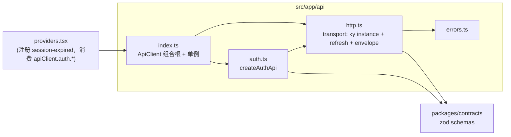

# Admin API Client 重构计划（SSOT）

## 状态与用途

- 决策日期：2026-08-02
- 状态：已完成
- 文档类型：实施计划（Single Source of Truth）
- 读者：实施者（Nea / 后续会话）、维护者
- 关联文档：[Admin 技术栈设计](../design/2026-08-01-admin-technology-stack.md)、[认证系统计划](./2026-08-02-grey-flowers-authentication-system.md)

> 本文件是 admin 侧 API client 层重构的唯一事实来源。实现时一切以本文为准；若实现过程中发现本文与实际冲突，先改本文再改代码，不要悄悄偏离设计。

---

## 1. 目标

把 `apps/admin/src/app/api-client.ts` 中「传输基础设施」与「领域接口定义」焊死在一起的上帝类，重构为**组合根单例 + 一域一文件**的分层结构，并用已安装的 `ky`（v2.0.2）消除手写 fetch 样板，同时完整保留现有会话刷新与错误契约的语义。

## 2. 现状与根因

### 2.1 现状

- `apps/admin` 是 React + Vite SPA，通过 HTTP 调用 `apps/api`（Hono），路径前缀 `/auth`（无 `/api` 段）。
- `api-client.ts` 是一个 `ApiClient` 类，包含 `login/refresh/logout/session` 四个方法与 ~80% 的传输样板：URL 拼接、Bearer 注入、refresh 单飞去重、`AUTH_REQUIRED` 重试一次、envelope 拆包、三类错误归一化。
- `providers.tsx` 在组件内 `new ApiClient(...)`，并通过 `onAuthenticationRequired` 回调直接驱动 React 状态。
- `ky@2.0.2` 已在 `apps/admin/node_modules`（catalog 版本），当前零使用。

### 2.2 根因（不是「类」，是「分层」）

`ApiClient` 把两类性质完全不同的东西焊在一起：

| 类别                | 内容                                                                         | 增长方式               |
| ------------------- | ---------------------------------------------------------------------------- | ---------------------- |
| **A. 传输基础设施** | URL 拼接、Bearer 注入、refresh 去重与重试、envelope 拆包、错误归一化、cookie | 跨领域共用，只应写一次 |
| **B. 领域定义**     | `login/refresh/logout/session` 各自的 `{method, path, body, schema}`         | 按领域线性增长         |

只要 A、B 仍焊死在一个类/单文件里，每个新领域（文章、用户、资源…）都必须往同一个类里加方法 → 必然膨胀成上帝类。正确的切开方式：**transport 只写一次；每个领域一个独立、极薄的文件。**

## 3. 已确认的决策（决策记录）

| #   | 决策                                         | 内容                                                                                                                                                                                                 |
| --- | -------------------------------------------- | ---------------------------------------------------------------------------------------------------------------------------------------------------------------------------------------------------- |
| D1  | 薄包装 over ky                               | 传输核心 `http.*` 返回**已拆包**的数据 `T`；refresh 去重/重试、envelope、错误归一化全部集中在 transport，不拆进 ky hook。ky 只负责消机械样板（`prefixUrl`/`json`/`.json()`/`credentials`）。         |
| D2  | 契约双向闭环，全量 safeParse                 | `packages/contracts` 是 RPC 边界：**输入由 Hono 侧强制（enforcement），输出由 React 侧验证（verification）**，同一份 zod schema 两个方向。所有响应一律过 `schema.safeParse`，不做「data 可选」捷径。 |
| D3  | 一域一文件、一文件一工厂                     | `src/app/api/auth.ts` 仅导出 `createAuthApi(http)`；未来每领域一个 `.ts`，仅导出自己的 `createXxxApi`。                                                                                              |
| D4  | 框架无关 + 项目内单例                        | `export const apiClient = new ApiClient()`，模块顶层构造。React 通过 `apiClient.setSessionExpiredHandler(fn)` 订阅会话过期，核心不依赖 React。                                                       |
| D5  | refresh 属于 transport                       | refresh 无痕地「凭据续期」，是 transport 自身的机制（它续的就是 transport 注入的凭据），因此保留在 `http.ts`，不在业务域。                                                                           |
| D6  | envelope 用 contracts 现成的 response schema | endpoint 模块传 `authLoginResponseSchema` 这类（=`apiSuccessSchema(data)` 的完整信封），transport 内部 decode → `.data`；返回值类型从 schema 推导，不手写断言。                                      |

### 3.1 为什么「全量 safeParse」是对的（D2 的论据）

- schema 反正已随 contracts 打包，zod 无论如何都会进 bundle，验证零边际成本。
- 失败路径已存在且语义正确：`ApiResponseError` 不触发 refresh-retry（重试只认 `AUTH_REQUIRED`）。
- 价值：契约漂移 / 序列化 bug 从「静默 `undefined` 渗进 React state」变成「请求局部、类型化、响亮」的边界错误。
- 有意的对称取舍：**输入只在 server 侧 safeParse，输出只在 client 侧 safeParse**。客户端再验输入是双重校验、多一条无安全收益的错误路径。

## 4. 目标结构

```
apps/admin/src/app/api/
  errors.ts   # 三个错误类 + is* 判断（公开形状与现在完全一致）
  http.ts     # createHttp：ky 实例 + token 注入 + refresh 去重/重试 + envelope safeParse + 错误归一化
  auth.ts     # 仅导出 createAuthApi(http)
  index.ts    # ApiClient 组合根 + export const apiClient 单例 + token/origin 搬运 + errors 重导出
```



未来的领域域只在其文件（`articles.ts` 等）中导出 `createArticlesApi(http)`，并在 `ApiClient` 组合根挂 `readonly articles`。

## 5. 逐文件规格（完整代码）

### 5.1 `apps/admin/src/app/api/errors.ts`（新建）

语义与现 `api-client.ts` 中的实现逐字节一致，仅搬迁并收紧 import。

```ts
import {
  apiFailureSchema,
  type ApiErrorCode,
  type ApiFailure,
} from '@grey-flowers/contracts';

export class ApiRequestError extends Error {
  readonly code: ApiErrorCode;
  readonly fields: ApiFailure['error']['fields'];
  readonly requestId: string;
  readonly status: number;

  constructor(failure: ApiFailure, status: number) {
    super(failure.error.message);
    this.name = 'ApiRequestError';
    this.code = failure.error.code;
    this.fields = failure.error.fields;
    this.requestId = failure.requestId;
    this.status = status;
  }
}

export class ApiNetworkError extends Error {
  constructor(cause: unknown) {
    super('无法连接身份服务。');
    this.name = 'ApiNetworkError';
    this.cause = cause;
  }
}

export class ApiResponseError extends Error {
  constructor() {
    super('身份服务返回了无法识别的响应。');
    this.name = 'ApiResponseError';
  }
}

export function isApiRequestError(
  error: unknown,
  code?: ApiErrorCode,
): error is ApiRequestError {
  return (
    error instanceof ApiRequestError &&
    (code === undefined || error.code === code)
  );
}

export function isApiNetworkError(error: unknown): error is ApiNetworkError {
  return error instanceof ApiNetworkError;
}
```

### 5.2 `apps/admin/src/app/api/http.ts`（新建）

传输核心。设计要点：

- `ky.create({ prefixUrl, credentials: 'include', retry: 0, throwHttpErrors: false })`：`retry: 0` 关闭 ky 默认网络重试（保持现有语义）；`throwHttpErrors: false` 让 4xx/5xx 也走**同一套** envelope 解码（信封才是契约，HTTP status 次之）。
- `ResponseSchema<TData>` 鸭子接口 + `ResponseData<TSchema>` 类型推导：返回类型从请求携带的 schema 推导（如 `authLoginResponseSchema` → `AuthLoginData`），单一事实来源，不手写断言。
- refresh 属于 transport（D5）：`refreshOnce()` 单飞去重直接调用本模块的 `refresh()`；`send()` 内部对网络错误包 `ApiNetworkError`、无法 parse 包 `ApiResponseError`、信封校验失败包 `ApiRequestError`。
- 无 token 且有 `authenticated` 时**本地**抛 `ApiRequestError('AUTH_REQUIRED')`（与现状一致，且会被外层当作「需要续期」走 refresh 分支）。
- `session` 原 `credentials: 'omit'` 简化为实例级 `include`：`/auth/session` 走 `requirePrincipal`（只认 Bearer），多带 cookie 无害且 `/auth/*` 的 CORS `credentials: true` 本就要求 include。

```ts
import {
  apiFailureSchema,
  authRefreshResponseSchema,
  type AuthRefreshData,
} from '@grey-flowers/contracts';
import ky, { type KyInstance } from 'ky';

import {
  ApiNetworkError,
  ApiRequestError,
  ApiResponseError,
  isApiRequestError,
} from './errors.js';

const LOCAL_AUTH_REQUIRED_MESSAGE = '需要重新登录。';

export interface HttpOptions {
  prefixUrl: string;
  getAccessToken: () => string | null;
  setAccessToken: (accessToken: string | null) => void;
}

/** contracts 的 response envelope schema 的结构鸭子类型 */
interface ResponseSchema<TData> {
  safeParse: (
    value: unknown,
  ) => { success: true; data: { data: TData } } | { success: false };
}

type ResponseData<TSchema> =
  TSchema extends ResponseSchema<infer TData> ? TData : never;

export interface HttpRequestOptions<
  TSchema extends ResponseSchema<unknown>,
> extends Omit<RequestInit, 'body' | 'headers' | 'method' | 'signal'> {
  authenticated?: boolean;
  retryOnAuthRequired?: boolean;
  json?: unknown;
  schema: TSchema;
}

type HttpMethod = 'get' | 'post' | 'patch' | 'delete';

export function createHttp(options: HttpOptions) {
  const api: KyInstance = ky.create({
    prefixUrl: options.prefixUrl,
    credentials: 'include',
    retry: 0,
    throwHttpErrors: false,
  });

  let refreshPromise: Promise<AuthRefreshData> | undefined;
  let sessionExpiredHandler: () => void = () => {};

  function setSessionExpiredHandler(handler: () => void) {
    sessionExpiredHandler = handler;
  }

  function expireAccess() {
    options.setAccessToken(null);
    sessionExpiredHandler();
  }

  async function send<TData>(
    method: HttpMethod,
    path: string,
    requestOptions: HttpRequestOptions<ResponseSchema<TData>>,
  ): Promise<TData> {
    if (requestOptions.authenticated) {
      const accessToken = options.getAccessToken();

      if (!accessToken) {
        throw new ApiRequestError(
          {
            success: false,
            error: {
              code: 'AUTH_REQUIRED',
              message: LOCAL_AUTH_REQUIRED_MESSAGE,
            },
            requestId: '',
          },
          401,
        );
      }
    }

    let response: Response;

    try {
      response = await api[method](path, {
        json: requestOptions.json,
        headers: requestOptions.authenticated
          ? { Authorization: `Bearer ${options.getAccessToken()}` }
          : undefined,
      });
    } catch (error) {
      throw new ApiNetworkError(error);
    }

    let body: unknown;

    try {
      body = await response.json();
    } catch {
      throw new ApiResponseError();
    }

    const parsed = requestOptions.schema.safeParse(body);

    if (parsed.success) {
      return parsed.data.data;
    }

    const failure = apiFailureSchema.safeParse(body);

    if (failure.success) {
      throw new ApiRequestError(failure.data, response.status);
    }

    throw new ApiResponseError();
  }

  async function request<TData>(
    method: HttpMethod,
    path: string,
    requestOptions: HttpRequestOptions<ResponseSchema<TData>>,
  ): Promise<TData> {
    try {
      return await send(method, path, requestOptions);
    } catch (error) {
      if (
        requestOptions.authenticated &&
        requestOptions.retryOnAuthRequired !== false &&
        isApiRequestError(error, 'AUTH_REQUIRED')
      ) {
        try {
          await refreshOnce();
        } catch {
          expireAccess();
          throw error;
        }

        try {
          return await request(method, path, {
            ...requestOptions,
            retryOnAuthRequired: false,
          });
        } catch (retryError) {
          if (isApiRequestError(retryError, 'AUTH_REQUIRED')) {
            expireAccess();
          }

          throw retryError;
        }
      }

      throw error;
    }
  }

  function refreshOnce() {
    if (!refreshPromise) {
      refreshPromise = refresh().finally(() => {
        refreshPromise = undefined;
      });
    }

    return refreshPromise.then((response) => {
      options.setAccessToken(response.accessToken);
      return response;
    });
  }

  function refresh(): Promise<AuthRefreshData> {
    return request('post', '/auth/refresh', {
      schema: authRefreshResponseSchema,
    });
  }

  return {
    get: <TSchema extends ResponseSchema<unknown>>(
      path: string,
      requestOptions: HttpRequestOptions<TSchema>,
    ) => request<ResponseData<TSchema>>('get', path, requestOptions),
    post: <TSchema extends ResponseSchema<unknown>>(
      path: string,
      requestOptions: HttpRequestOptions<TSchema>,
    ) => request<ResponseData<TSchema>>('post', path, requestOptions),
    patch: <TSchema extends ResponseSchema<unknown>>(
      path: string,
      requestOptions: HttpRequestOptions<TSchema>,
    ) => request<ResponseData<TSchema>>('patch', path, requestOptions),
    delete: <TSchema extends ResponseSchema<unknown>>(
      path: string,
      requestOptions: HttpRequestOptions<TSchema>,
    ) => request<ResponseData<TSchema>>('delete', path, requestOptions),
    refresh,
    setSessionExpiredHandler,
  };
}

export type Http = ReturnType<typeof createHttp>;
```

> 注：`HttpRequestOptions` 的 `extends Omit<RequestInit, …>` 是为未来透传 ky/RequestInit 选项预留的宽松约束；`authenticated/retryOnAuthRequired/json/schema` 是既定选项。若 `Omit` 这层在当前 TS 配置下引入类型摩擦，可退化为无约束的 plain interface——以 typecheck 通过为准，勿为此造复杂度。

### 5.3 `apps/admin/src/app/api/auth.ts`（新建）

一域一文件、一文件一工厂（D3）。返回值类型由 schema 推导（D6），无需手写泛型。

```ts
import {
  type AuthLoginData,
  type AuthLoginInput,
  type AuthLogoutData,
  type AuthSessionData,
  authLoginResponseSchema,
  authLogoutResponseSchema,
  authSessionResponseSchema,
} from '@grey-flowers/contracts';

import type { Http } from './http.js';

export function createAuthApi(http: Http) {
  return {
    login: (input: AuthLoginInput): Promise<AuthLoginData> =>
      http.post('/auth/login', {
        json: input,
        schema: authLoginResponseSchema,
      }),
    logout: (): Promise<AuthLogoutData> =>
      http.post('/auth/logout', { schema: authLogoutResponseSchema }),
    session: (): Promise<AuthSessionData> =>
      http.get('/auth/session', {
        authenticated: true,
        schema: authSessionResponseSchema,
      }),
  };
}

export type AuthApi = ReturnType<typeof createAuthApi>;
```

### 5.4 `apps/admin/src/app/api/index.ts`（新建）

组合根 + 单例。token 存取（localStorage）与 origin 解析从 `providers.tsx` 搬到此（藏在模块内部，不导出），`ApiClient` 保持 ~20 行。

```ts
import { createAuthApi, type AuthApi } from './auth.js';
import { createHttp } from './http.js';

export {
  ApiNetworkError,
  ApiRequestError,
  ApiResponseError,
  isApiNetworkError,
  isApiRequestError,
} from './errors.js';

const ACCESS_TOKEN_KEY = 'gf.access_token';

function getApiOrigin() {
  const origin = import.meta.env.VITE_API_ORIGIN;

  if (!origin) {
    throw new Error('Admin API origin is unavailable.');
  }

  return new URL(origin).toString();
}

function getAccessToken() {
  return localStorage.getItem(ACCESS_TOKEN_KEY);
}

function setAccessToken(accessToken: string | null) {
  if (accessToken) {
    localStorage.setItem(ACCESS_TOKEN_KEY, accessToken);
    return;
  }

  localStorage.removeItem(ACCESS_TOKEN_KEY);
}

export class ApiClient {
  readonly auth: AuthApi;

  private readonly http = createHttp({
    prefixUrl: getApiOrigin(),
    getAccessToken,
    setAccessToken,
  });

  constructor() {
    this.auth = createAuthApi(this.http);
  }

  /** transport 凭据续期（refresh 属于 transport，见 D5） */
  refresh() {
    return this.http.refresh();
  }

  /** React 侧只通过这里订阅会话过期；核心保持框架无关（D4） */
  setSessionExpiredHandler(handler: () => void) {
    this.http.setSessionExpiredHandler(handler);
  }
}

export const apiClient = new ApiClient();
```

### 5.5 `apps/admin/src/app/providers.tsx`（修改）

- import 改为 `from './api/index.js'` 拿 `apiClient` + `isApiRequestError`/`isApiNetworkError`。
- 删除本地 `ACCESS_TOKEN_KEY`、`getApiOrigin`、`getAccessToken`、`setAccessToken` 与 `const [apiClient] = useState(new ApiClient(...))`。
- 挂载时注册一次会话过期订阅：
  ```tsx
  useEffect(() => {
    apiClient.setSessionExpiredHandler(handleAuthenticationRequired);
  }, []);
  ```
- 调用点替换：
  - `apiClient.login(input)` → `apiClient.auth.login(input)`
  - `apiClient.session()` → `apiClient.auth.session()`
  - `apiClient.refresh()` → `apiClient.refresh()`（不变）
  - `apiClient.logout()` → `apiClient.auth.logout()`
- `restoreSession`、`signIn`、`signOut`、`messageFor` 的控制流与错误分支**一行不动**。

### 5.6 删除旧文件

`apps/admin/src/app/api-client.ts` 删除。全仓搜索确认无残留引用（当前唯一引用方是 `providers.tsx`）。

## 6. 必须保留的行为契约（验收对照表）

| #   | 行为                                               | 现状                                                                             | 新实现必须一致                                 |
| --- | -------------------------------------------------- | -------------------------------------------------------------------------------- | ---------------------------------------------- |
| B1  | `login`                                            | POST `/auth/login`，json body，`credentials: include`，不带 Bearer               | 同                                             |
| B2  | `refresh`                                          | POST `/auth/refresh`，`credentials: include`，不带 Bearer                        | 同（位于 transport）                           |
| B3  | `logout`                                           | POST `/auth/logout`，`credentials: include`，不带 Bearer                         | 同                                             |
| B4  | `session`                                          | GET `/auth/session`，带 Bearer，无 cookie                                        | 带 Bearer；cookie 改为 include（无害，见 5.2） |
| B5  | 无 token + `authenticated`                         | 本地抛 `ApiRequestError('AUTH_REQUIRED')`                                        | 同                                             |
| B6  | 鉴权请求遇 `AUTH_REQUIRED`                         | refresh 单飞 → 成功则原请求重试一次（`retryOnAuthRequired: false`）              | 同                                             |
| B7  | refresh/重试后仍 `AUTH_REQUIRED`                   | `expireAccess()`（清 token + 触发会话过期）                                      | 同                                             |
| B8  | refresh 本身失败                                   | `expireAccess()` + 抛出**原请求**错误                                            | 同                                             |
| B9  | 网络层失败（fetch 拒绝）                           | `ApiNetworkError`（`无法连接身份服务。`）                                        | 同                                             |
| B10 | 响应非预期（非 JSON / 信封不匹配 / data 形状不符） | `ApiResponseError`（`身份服务返回了无法识别的响应。`），**不触发 refresh-retry** | 同                                             |
| B11 | 服务端明确失败（`success:false` 信封）             | `ApiRequestError`（携带 `code/fields/requestId/status`）                         | 同                                             |
| B12 | 并发 refresh                                       | 单飞去重（共享 `refreshPromise`）                                                | 同                                             |

## 7. 实施步骤（bite-sized tasks）

> 基础环境复用：`apps/admin` package.json 已有 `typecheck`(`tsc -p tsconfig.json --noEmit`)、`lint`(oxlint)、`build`(vite build)、`fmt`(oxfmt)。ky@2.0.2 已在 node_modules，**无需安装**。

### Task 1：新建 `errors.ts`

- **文件**：Create `apps/admin/src/app/api/errors.ts`（内容见 §5.1）
- **验证**：`cd apps/admin && pnpm typecheck` → 无错误
- **提交**：`git add apps/admin/src/app/api/errors.ts && git commit -m "refactor(admin): 抽取 API 错误类型到独立模块"`

### Task 2：新建 `http.ts`（transport 核心）

- **文件**：Create `apps/admin/src/app/api/http.ts`（内容见 §5.2）
- **验证**：`pnpm typecheck` + `pnpm lint` → 通过
- **提交**：`git commit -am "refactor(admin): 新增基于 ky 的 transport 层"`

### Task 3：新建 `auth.ts`

- **文件**：Create `apps/admin/src/app/api/auth.ts`（内容见 §5.3）
- **验证**：`pnpm typecheck` → 通过（此时文件未被引用，纯类型自检）
- **提交**：`git commit -am "refactor(admin): 新增 createAuthApi 领域模块"`

### Task 4：新建 `index.ts`（组合根 + 单例）

- **文件**：Create `apps/admin/src/app/api/index.ts`（内容见 §5.4）
- **验证**：`pnpm typecheck` + `pnpm lint` → 通过
- **提交**：`git commit -am "refactor(admin): 新增 ApiClient 组合根与项目单例"`

### Task 5：改造 `providers.tsx` 消费端

- **文件**：Modify `apps/admin/src/app/providers.tsx`（见 §5.5）
- **验证**：`pnpm typecheck` + `pnpm lint` + `pnpm build` → 全部通过
- **提交**：`git commit -am "refactor(admin): providers 切换到 apiClient 组合根"`

### Task 6：删除旧 `api-client.ts`

- **文件**：Delete `apps/admin/src/app/api-client.ts`
- **先搜索**：`rg "api-client" apps/admin` → 无命中再删
- **验证**：`pnpm typecheck` + `pnpm lint` + `pnpm build` → 全部通过
- **提交**：`git commit -am "refactor(admin): 移除旧的 god-object api-client"`

### Task 7：手动端到端验证（真实环境）

- 启动：`pnpm dev:api`（终端 A）+ `pnpm dev:admin`（终端 B）
- 浏览器打开 admin，执行全流程：
  1. **登录** → 进入后台（验证 `auth.login` + token 落 localStorage）
  2. **会话恢复**：刷新页面 → 仍保持登录（验证 `auth.session` / `refresh` 分支）
  3. **登出** → 回到未登录（验证 `auth.logout` + 清 token）
- 可选验证 refresh 分支：登录后手工删除 access token 只留 refresh cookie，再翻页触发一次受保护请求，应自动续期成功。

### Task 8：收尾

- `pnpm fmt` + `pnpm fmt:check`（oxfmt）确保格式一致
- 全仓 `pnpm typecheck`、`pnpm lint` 兜底
- 本文状态字段「状态」改为「已完成」并在末尾追加实现日期与实现要点

## 8. 风险与取舍

- **refresh 放 transport（D5）**：`http.ts` 会 import `authRefreshResponseSchema`，看似「transport 依赖 auth 域」。取舍是：refresh 续的是 transport 注入的凭据，本质是传输机制而非业务端点；换来组合根零循环依赖、无需 DI 回调。若未来 refresh 换路径，只改 `http.ts` 一处。
- **schema 全部走 response envelope（D6）**：contracts 每个端点同时导出 `*DataSchema` 与 `*ResponseSchema`，本设计统一使用 `*ResponseSchema`（与旧实现一致），不引入「把 data schema 再包一层 envelope」的胶水。
- **`credentials: include` 全局化**：`session` 由 `omit` 改为 `include`。请求 `/auth/*` 本就要求 CORS `credentials: true`，且该端点只认 Bearer；不影响已达成一致的安全边界。若未来 session 路由开始读 cookie 鉴权，此变更需重新评估。
- **类型推导（`ResponseData<TSchema>`）**：是本次唯一新增的类型级构造。返回值来自契约 schema 单一来源，防止「手写泛型与 schema 漂移」；代价是若该类型工具在 TS 配置下报错，回退方案为显式 `http.get<AuthLoginData>(...)`（语义不变）。
- **ky 行为默认值**：`retry: 0` 与 `throwHttpErrors: false` 必须显式设置——忘记前者会引入当前没有的网络自动重试（POST 重复提交风险），忘记后者会让错误响应在 `send()` 之外被 ky 提前 throw。

## 9. 范围外 / 未来扩展

- **失败响应已知 fast-fail**：`ApiRequestError` 根据 `error.code` 区分（`AUTH_FORBIDDEN`/`AUTH_REQUIRED`/`VALIDATION_FAILED`…），`providers` 已按此分支；本轮不新增通用错误 UI。
- **单测**：admin 当前无测试框架。若后续引入 Vitest，`http.ts`（refresh 去重、三类错误映射、`retryOnAuthRequired` 语义）是最值得单测的模块——设计已按可测试性组织（`createHttp(options)` 纯工厂、选项注入），到时补 fixture 即可。本轮不加测试基建（YAGNI）。
- **查询/缓存层**：react-query 等不在本轮范围；领域模块是纯函数对象，未来可被任意 hooks 消费。
- **新领域接入范式**：`articles.ts` 导出 `createArticlesApi(http)`，`ApiClient` 加 `readonly articles = createArticlesApi(this.http)`，调用方 `apiClient.articles.*`。横切能力零新增。

---

## 实现记录

- 实现日期：2026-08-02
- 实现要点：
  - 拆分 `apps/admin/src/app/api/{errors,http,auth,index}.ts` 分层结构，`apiClient` 项目单例 + `apiClient.auth.*` 领域接口。
  - transport 用 `ky@2.0.2` 消除手写 fetch 样板；`createHttp` 内含 Bearer 注入、refresh 单飞去重与 AUTH_REQUIRED 重试、envelope safeParse、三类错误归一化。
  - 保持 B1–B12 行为契约逐项一致（login/refresh/logout/session、无 token 本地 AUTH_REQUIRED、refresh 重试语义、错误映射）。
  - 消费端 `providers.tsx` 用 `useEffect` 注册一次 `setSessionExpiredHandler`；token 存取的 `get/setAccessToken` 从 `apiClient` 私藏改为从 `api/index` 导出以便 providers 控制流逐行不动。
  - 偏差记录：
    - ky v2 将 `prefixUrl` 重命名为 `prefix`（计划 §5.2 按 v1 语义书写），已按实际 API 使用 `prefix`。
    - `refresh` 由调用 `request` 改为直接调用 `send`（refresh 无 `authenticated`，`request` 的重试分支永不触发，语义等价），同时消除 oxlint `no-use-before-define`。
    - transport 内部 `send`/`request` 改为对 `TSchema` 直接泛型以通过 typecheck（§5.2 预留的退路）。
  - 复核修正：admin 已启用 react-compiler（`vite.config.ts` 的 `reactCompilerPreset`），按项目约定移除 `providers.tsx` 中既有的 `useCallback`——`moveToGuardedState`/`restoreSession` 改为普通函数，bootstrap `useEffect` 依赖收敛为空数组（`hasBootstrapped` ref 已保证单次执行）。
  - 验证：`pnpm typecheck` / `pnpm lint` / `pnpm build`（apps/admin）全部通过。
