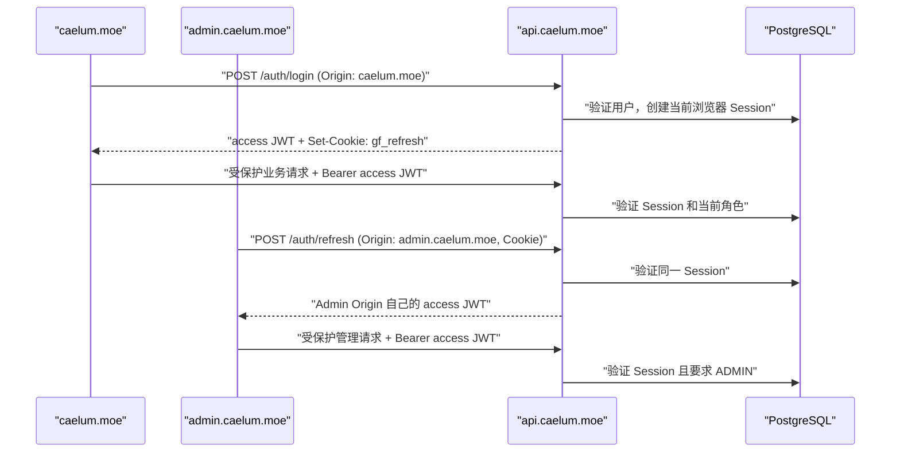

# Grey Flowers 认证系统设计

## 状态与权威

- 决策日期：2026-08-02
- 状态：已确认，可实施
- 文档类型：认证与授权专项实施计划
- 读者：实现 `packages/db`、`packages/contracts`、`apps/api`、`apps/main` 与 `apps/admin` 的维护者
- 执行权威：本文是本轮认证、会话、Principal、管理员授权、CORS、CSRF、统一错误合同及其主站迁移的**唯一 SSOT**。实现不得以旧 Nuxt 认证代码、旧后台或临时前端判断补充另一套规则。

本文落实 [后台运营工作流切片](../design/2026-08-02-admin-operational-workflow-slices.md)、[Hono Backend 架构设计](../design/2026-08-01-hono-backend-architecture.md) 与 [四个项目的身份定位](../design/2026-08-01-four-project-roles.md) 留出的认证设计。它只补全这些文档明确留待专项设计的部分，不改变其 API 唯一业务入口、Prisma 所有权和按工作流切片交付的边界。

认证基础可以现在开始实施；首个“受管理资产”切片的完成条件仍包含本文全部可用状态。认证本身不被包装成已完成的独立运营工作流，也不提前实现任何资产、文章、评论或用户运营接口。

## 目标、范围与完成标准

### 目标

建立一套由 API 集中签发和校验的认证系统，使公开主站与管理后台使用同一用户身份、同一 API 会话和同一授权规则：

- 公开主站：`https://caelum.moe`
- 管理后台：`https://admin.caelum.moe`
- API：`https://api.caelum.moe`

普通用户在主站登录后，访问后台可以恢复同一 API 会话；后台不拥有管理员专用登录协议。业务调用统一携带短期 `Authorization: Bearer <access JWT>`，API 对每次受保护调用重新确认会话与当前角色。`ADMIN` 是普通 `User` 的角色，不是另一套账户。

初始管理员的人工初始化目标账户为 `nonhana@outlook.com`。本地测试数据库当前没有用户，因此该账户必须先按普通注册流程创建，再由受保护的命令提升角色。

### 本计划包含

1. `Session` 持久化模型、迁移和多设备会话语义。
2. API 身份模块、JWT、会话刷新、Principal、角色检查与统一错误映射。
3. 认证合同、CORS、Cookie、Origin/CSRF 规则和环境变量。
4. 主站登录、注册、个人资料和遗留受保护 Nuxt 路由的迁移。
5. Admin 最小登录、SSO 启动恢复和管理员路由守卫。
6. 首位管理员的幂等提升命令、验证、上线与回滚规则。

### 本计划不包含

- Asset、文章、分类、标签、音乐、动态、评论、用户运营或仪表盘的领域接口和页面。
- 设备会话列表、远程踢出单台设备、登录历史 UI、邮件验证、密码找回、MFA、OAuth 或通行密钥。
- 通用权限表、可配置权限编辑器、组织/租户模型或新的共享包。
- API/Admin 的部署自动化实现、容器化、网关、速率限制服务或监控平台；本文只给出它们必须满足的发布前置条件。
- 新测试框架、覆盖率、Husky 或 lint-staged。

### 完成标准

本计划完成后，以下条件必须全部成立：

1. API 是唯一签发、验证 access JWT、创建/撤销 Session、建立 Principal 和判断 `ADMIN` 的运行时位置。
2. 公开站与 Admin 的浏览器均只用 API 签发的 access JWT 调用受保护接口；不会再自行签名或验证 JWT。
3. 同一浏览器先登录主站、再打开 Admin 时，无须重复输入密码即可恢复管理员会话；普通用户会被 Admin 守卫拒绝。
4. 一个用户可在多个浏览器或设备中同时登录；退出仅撤销当前浏览器会话，修改密码或移除 `ADMIN` 会撤销该用户全部会话。
5. refresh 凭证从不暴露给 JavaScript、从不写入 `localStorage`、从不作为业务 API 的认证方式。
6. API 的认证失败、权限拒绝、校验错误和内部错误都使用稳定错误码和同一响应形状。
7. 旧主站 JWT 签发/校验秘密和按路径黑名单的认证实现不再是身份真相；保留的遗留业务路由经 API 建立 Principal。

## 已确认的架构选择

### 凭证分工

| 凭证         | 位置                                                             | 生命周期                 | 用途                                                                | JavaScript 可读性 |
| ------------ | ---------------------------------------------------------------- | ------------------------ | ------------------------------------------------------------------- | ----------------- |
| access JWT   | 每个站点 Origin 自己的 `localStorage`，键名 `gf.access_token`    | 15 分钟                  | 每个受保护业务请求的 `Authorization: Bearer`                        | 可读              |
| refresh 凭证 | `api.caelum.moe` 的 host-only HttpOnly Cookie，名为 `gf_refresh` | 最长 30 天，绝不滑动续期 | 仅 `POST /auth/refresh` 与 `POST /auth/logout` 的 API 会话恢复/撤销 | 不可读            |
| Session      | PostgreSQL                                                       | 最长 30 天或显式撤销     | refresh 凭证的服务端事实、即时撤销和多设备隔离                      | 不适用            |

access JWT 只承载短期身份线索，不能单独决定“现在还能否访问”。API 每次验证签名后都以 `sid` 查询仍有效的 Session 及其用户，随后才创建 Principal。因此登出、改密和撤销管理员角色立即生效，不需要等待 15 分钟 access JWT 自然过期。

### 为什么不把 access JWT 放进 Cookie

业务 API 统一使用 `Authorization`，浏览器请求默认 `credentials: 'omit'`。这避免把所有写操作变成 Cookie 自动附带的 CSRF 面；refresh Cookie 只进入两个专用认证端点，且这些端点有严格 Origin 检查。access JWT 即使被 XSS 读到，使用窗口也只有 15 分钟，且 Session 撤销会立即使其失效。

### 为什么 refresh 凭证不在每次刷新时轮换

本系统的 API Cookie 同时被 `caelum.moe` 和 `admin.caelum.moe` 使用。两个 Origin 各自有 `localStorage`，却可能在同一时间用同一个 Cookie 刷新。若每次刷新都单次消费、轮换 refresh token，就必须在“另一站点的合法并发刷新”和“凭证重放”之间猜测；这会把正常 SSO 变成偶发登出。

因此，一个浏览器配置文件对应一个稳定 Session 和一个稳定 refresh 凭证：刷新只更新 `lastUsedAt` 并签发新的 access JWT，不替换 Cookie。风险边界是 refresh 凭证若被盗用，在它过期或被撤销前可继续刷新；该凭证受 `HttpOnly`、`Secure`、host-only、`SameSite=Strict`、精确 CORS 和强制 Origin 检查保护，且最长仅 30 天。密码变更、角色降级和显式登出可即时切断它。对这套只有一个 API Cookie 的 SSO 拓扑而言，这比无法可靠处理的旋转机制更小、更可预测。

### 明确拒绝的方案

| 方案                                         | 结论 | 原因                                                                         |
| -------------------------------------------- | ---- | ---------------------------------------------------------------------------- |
| Main 使用 JWT，Admin 使用独立 Cookie/Session | 拒绝 | 会形成两套登录语义和两个授权入口，破坏 API 作为身份 SSOT。                   |
| access JWT 放 HttpOnly Cookie                | 拒绝 | 会让全部业务写请求变成 Cookie 认证，扩大 CSRF 面，也偏离统一 Bearer 调用。   |
| refresh token 存入 `localStorage`            | 拒绝 | XSS 可取得长期凭证，不能接受。                                               |
| 前端解析 `exp` 后定时主动刷新                | 拒绝 | 前端不以 JWT 的 `exp` 作认证决策；只在 API 明确返回 `AUTH_REQUIRED` 时恢复。 |
| 首个注册用户或指定邮箱自动成为管理员         | 拒绝 | 空库、顺序错误或公开注册都不能隐式授予管理权限。                             |
| 通用 RBAC 表和权限编辑器                     | 拒绝 | 当前只有 `USER`、`ADMIN` 两个已证实角色；中间层只提供明确的角色检查。        |

## 域名、SSO 与请求拓扑



Cookie 不设置 `Domain`，因此它只能由 `api.caelum.moe` 接收和发送，主站与后台都不能读取或覆盖它。三个 HTTPS 子域属于同一 schemeful site，`SameSite=Strict` 不会阻止它们向 API 的同站请求，但来自其他网站的请求不会携带它。

### CORS 与 Cookie 的精确规则

生产环境允许 Origin 只有：

```text
https://caelum.moe
https://admin.caelum.moe
```

API 的 CORS 中间件必须逐一比较 `Origin`，不使用 `*`、正则泛匹配或反射任意 Origin。认证阶段仅允许 `GET, POST, PATCH, OPTIONS` 和请求头 `Authorization, Content-Type, X-Request-Id`，对允许 Origin 返回 `Vary: Origin` 与 `Access-Control-Allow-Credentials: true`。不在清单的 Origin 不返回允许跨域读取的响应头。后续领域切片若合同确实需要 `PUT` 或 `DELETE`，只能在其专项设计中扩展方法集合；Origin 清单、凭证策略和 Origin 检查规则不变。

`POST /auth/register`、`POST /auth/login`、`POST /auth/refresh`、`POST /auth/logout` 与 `PATCH /auth/me` 必须存在且精确匹配允许 Origin；缺少 `Origin` 或 Origin 不在清单时返回 `AUTH_FORBIDDEN`，不读取 Cookie、不改变数据。这样 Cookie 认证的 refresh/logout 既受 SameSite 保护，也有服务器端 CSRF 边界。`GET /auth/session` 不使用 Cookie，只接受 Bearer JWT；API 到 API 的 server-to-server 调用也只使用它。

`gf_refresh` 的固定属性如下：

```text
HttpOnly; Secure; SameSite=Strict; Path=/auth; Max-Age=2592000
```

它不设置 `Domain`，也不设置比 `/auth` 更宽的 Path。`AUTH_COOKIE_SECURE` 不再是环境变量：API 在 `NODE_ENV=development` 时固定为 `false`，在 `NODE_ENV=production` 时固定为 `true`，生产环境没有关闭 `Secure` 的配置入口。

## 领域模型与会话规则

### Principal

Principal 是 API 已验证的当前请求身份，不是浏览器自行解码 JWT 后得到的对象。

```ts
type Principal = {
  userId: number;
  sessionId: string;
  role: 'USER' | 'ADMIN';
  email: string;
  username: string;
  avatar: string;
  site: string | null;
};
```

`role` 只能来自当前数据库 `User.role`，不从前端输入或 JWT 自己推断。业务模块只消费 `Principal`，不接触 Cookie、JWT 字符串或数据库密码字段。

### access JWT

API 使用 `jose` 的 HS256 签名，密钥只存在 API 环境变量 `AUTH_ACCESS_TOKEN_SECRET`。JWT 头部使用 `typ: at+jwt`，payload 必须且只能包含下列认证字段：

| Claim        | 值                                                                                             |
| ------------ | ---------------------------------------------------------------------------------------------- |
| `iss`        | 由 `NODE_ENV` 派生；生产固定为 `https://api.caelum.moe`，开发为 `http://localhost:${API_PORT}` |
| `aud`        | 固定 `grey-flowers-web`                                                                        |
| `sub`        | 十进制字符串形式的 `User.id`                                                                   |
| `sid`        | `Session.id`                                                                                   |
| `token_use`  | 固定 `access`                                                                                  |
| `iat`、`exp` | 签发时间和 15 分钟后过期时间                                                                   |

JWT 不含密码、邮箱、头像、站点、角色、refresh secret 或 Session 状态。验证时必须同时检查算法、`iss`、`aud`、`token_use`、`sub` 与 `sid` 格式、过期时间，以及数据库中的 Session 和 User。任一步失败统一视为 `AUTH_REQUIRED`。

### `Session` Prisma 模型

每次成功登录为当前浏览器配置文件创建一行 Session。一个用户因此天然拥有多行 Session，即多设备、多浏览器或同一设备的不同浏览器配置文件。Session 不以 IP、User-Agent 或“设备名”判断身份，避免把不可靠的浏览器指纹写成安全边界。

在 `User` 上增加 `sessions Session[]`，并在 `packages/db/prisma/schema.prisma` 新增：

```prisma
model Session {
  id                String               @id @default(cuid())
  userId            Int
  refreshSecretHash String
  createdAt         DateTime             @default(now())
  lastUsedAt        DateTime             @default(now())
  expiresAt         DateTime
  revokedAt         DateTime?
  revokeReason      SessionRevokeReason?
  user              User                 @relation(fields: [userId], references: [id], onDelete: Cascade)

  @@index([userId, revokedAt, expiresAt])
  @@index([expiresAt])
}

enum SessionRevokeReason {
  LOGOUT
  PASSWORD_CHANGED
  ROLE_CHANGED
}
```

字段语义：

- `id` 是 Cookie 中的查找键，也是 access JWT 的 `sid`；它不替代 secret。
- `refreshSecretHash` 是 `HMAC-SHA-256(AUTH_REFRESH_TOKEN_PEPPER, refreshSecret)` 的固定长度编码。数据库只保存哈希，绝不保存 refresh secret 明文。
- `expiresAt` 在登录时设为 `createdAt + 30 days`，refresh 不修改它。
- `lastUsedAt` 只在成功 refresh 时更新，用于未来人工会话管理和排障；它不延长生命周期。
- `revokedAt` 为非空即永久失效。`revokeReason` 仅记录显式撤销原因；自然到期不写入伪撤销记录。
- `onDelete: Cascade` 使未来经过授权的用户物理删除不会留下可认证 Session。用户删除的领域规则仍属于“用户运营”切片。

Session 表不加入 `familyId`、轮换链、设备 JSON、IP 或 User-Agent 字段。当前稳定凭证模型不需要它们；不要为了未来设备管理预建数据结构。到期/撤销行暂不做定时清理，`expiresAt` 索引为将来已获批准的保留策略预留查询能力。

### refresh 凭证格式与验证

Cookie 值严格为：

```text
<sessionId>.<refreshSecret>
```

`sessionId` 使用 Prisma 生成的 CUID；`refreshSecret` 使用 Node `crypto.randomBytes(32)` 后的 base64url 编码。解析必须恰有一个 `.`，两段均非空，且不接受额外字段。API 通过 `sessionId` 查询单行 Session，再以常量时间比较由 `refreshSecret` 与 pepper 算得的 HMAC；同时检查 `revokedAt IS NULL`、`expiresAt > now()`、关联 User 存在。验证通过才签发 access JWT。

并发 refresh 可以同时验证同一有效 Session，并各自得到 access JWT；Cookie 值不变，`lastUsedAt` 的最后一次写入即可。这是有意的竞争规则，不需要刷新重试、前端锁跨 Origin 协调或“疑似重放即全家族撤销”的启发式判断。

### 会话状态迁移

| 事件                             | 数据库效果                                                                                     | 当前浏览器                       | 其他设备     |
| -------------------------------- | ---------------------------------------------------------------------------------------------- | -------------------------------- | ------------ |
| 成功登录                         | 创建一行新的 active Session；若 Cookie 指向当前浏览器已有 active Session，先撤销该行再创建新行 | 设置新 Cookie，取得 access JWT   | 不变         |
| 成功 refresh                     | 校验 active Session，更新 `lastUsedAt`                                                         | 签发新 access JWT，Cookie 不变   | 不变         |
| 当前浏览器退出                   | 当前 Cookie 对应行标记 `LOGOUT`，再清 Cookie                                                   | 当前 JWT 随即无法使用            | 不变         |
| 修改密码                         | 事务内更新密码并撤销该用户全部 active Session，原因为 `PASSWORD_CHANGED`                       | 清本 Origin access JWT，重新登录 | 全部立即失效 |
| `ADMIN` 被移除或角色被管理员修改 | 事务内更新角色并撤销该用户全部 active Session，原因为 `ROLE_CHANGED`                           | 所有 access JWT 立即失效         | 全部立即失效 |
| 自然到期                         | 不写数据；查询时拒绝                                                                           | refresh 失败并清 Cookie          | 各自到期     |

登录替换当前 Cookie Session 的规则保证同一浏览器先后切换账户不会遗留一个仍可刷新、但浏览器已不可见的会话。多设备从来不互相替换。

## API 合同与错误映射

### 统一响应形状

`packages/contracts` 定义全部 Zod input/output schema、错误码与 TypeScript 推导类型；不得导入 Prisma、Hono、Node 或 API 实现类型。API 所有 JSON 响应必须带 `X-Request-Id` 响应头，且 body 使用以下形状：

```ts
type ApiSuccess<T> = {
  success: true;
  data: T;
  requestId: string;
};

type ApiFailure = {
  success: false;
  error: {
    code: ApiErrorCode;
    message: string;
    fields?: Record<string, string[]>;
  };
  requestId: string;
};
```

`X-Request-Id` 在 API 为每次请求新建 UUID，不信任或回显调用方提供的值。`fields` 只用于 `VALIDATION_FAILED`，字段名必须是合同字段名，值为可显示的短消息；不得泄露 Zod 内部结构、数据库错误、SQL、密码哈希、refresh Cookie 或堆栈。

| HTTP | 错误码                     | 使用条件                                           |
| ---- | -------------------------- | -------------------------------------------------- |
| 400  | `VALIDATION_FAILED`        | body 或普通参数不符合合同。                        |
| 401  | `AUTH_INVALID_CREDENTIALS` | 登录账户不存在或密码不正确；两种情况消息完全相同。 |
| 401  | `AUTH_REQUIRED`            | 缺失、过期、伪造或已撤销 access/refresh 凭证。     |
| 403  | `AUTH_FORBIDDEN`           | Origin 不允许、当前角色不允许该操作。              |
| 404  | `NOT_FOUND`                | 调用方可安全处理的不存在资源。                     |
| 409  | `CONFLICT`                 | 用户名或邮箱已被占用等状态冲突。                   |
| 500  | `INTERNAL_ERROR`           | 未预期错误；日志仅以 request ID 关联详细诊断。     |

认证失败绝不在 `AUTH_INVALID_CREDENTIALS` 中区分“不存在账户”与“密码错误”。`AUTH_REQUIRED` 的客户端处理是尝试一次 refresh；`AUTH_FORBIDDEN` 不是 refresh 信号。

### 端点

所有路由都直接位于 `/auth`，不增加未经需要的 `/v1` 前缀。

| 端点                  | 成功状态 | 认证与 Origin                       | 输入                                                                           | 成功 `data`                                  | 特殊规则                                                                                                                                                                                                                |
| --------------------- | -------- | ----------------------------------- | ------------------------------------------------------------------------------ | -------------------------------------------- | ----------------------------------------------------------------------------------------------------------------------------------------------------------------------------------------------------------------------- |
| `POST /auth/register` | 201      | 精确允许 Origin                     | `{ username, email, password, site? }`                                         | `{ user: PublicUser }`                       | 维持当前密码长度 8-32、用户名长度 1-16 和可选合法 URL；邮箱仅 trim，保持既有 `User.email` 的精确匹配语义；头像由服务端从邮箱生成；只注册，不登录、不写 Cookie。                                                         |
| `POST /auth/login`    | 200      | 精确允许 Origin                     | `{ account, password }`                                                        | `{ accessToken, expiresIn: 900, principal }` | `account` 可为邮箱或用户名；成功时创建新 Session、设置 Cookie；失败统一为 `AUTH_INVALID_CREDENTIALS`。                                                                                                                  |
| `POST /auth/refresh`  | 200      | 精确允许 Origin + Cookie            | 无 body                                                                        | `{ accessToken, expiresIn: 900, principal }` | 只读 `gf_refresh`；成功更新 `lastUsedAt`；缺失、格式错误、伪造、过期或撤销的 Cookie 都清 Cookie 后返回 `AUTH_REQUIRED`。                                                                                                |
| `POST /auth/logout`   | 200      | 精确允许 Origin + Cookie            | 无 body                                                                        | `{}`                                         | 尽力撤销当前 Cookie 指向的 Session，始终清 Cookie 并返回成功，避免把失效 Cookie 变成状态探针。                                                                                                                          |
| `GET /auth/session`   | 200      | Bearer access JWT                   | 无 body                                                                        | `{ principal }`                              | 建立当前 Principal；不读取 Cookie；供浏览器启动校验和 Main 的遗留路由适配器使用。                                                                                                                                       |
| `PATCH /auth/me`      | 200      | 精确允许 Origin + Bearer access JWT | `{ username?, email?, site?: string \| null, currentPassword?, newPassword? }` | `{ principal, requiresReauthentication }`    | 只能更新本人；`site: null` 清空站点 URL；`currentPassword` 和 `newPassword` 必须同时出现；改密以 bcryptjs 验证旧密码、按当前成本 10 重哈希新密码，并在同一事务撤销所有 Session；此时 `requiresReauthentication: true`。 |

`PublicUser` 与 `principal` 均仅包含 `id`、`email`、`username`、`avatar`、`site`；`principal` 额外包含 `role` 和 API 内部不可由客户端伪造的 Session 语义。密码哈希、Session ID、refresh secret 与创建时间不出现在任何成功 DTO。

`PATCH /auth/me` 不接受 `id` 或 `role`。这取代当前可由 body 指定用户 ID 的主站 `user/edit` 路由，消除“凭请求 body 选择被修改账户”的路径。未来的管理员用户运营接口如有角色变更，必须调用同一身份模块的“更新角色并撤销全部会话”事务，而不能自行更新 `User.role`。

## Hono 组合、模块职责与调用规则

### 文件归属

实现保持 Hono 的标准中间件组合方式，但中间件只建立横切事实，不承载领域用例：

```text
packages/contracts/src/
├── auth.ts                         # Auth input/output Zod schema、错误码、推导类型
└── index.ts                        # 唯一再导出入口

packages/db/prisma/
├── schema.prisma                   # User.sessions、Session、SessionRevokeReason
└── migrations/<timestamp>_add_auth_sessions/migration.sql

apps/api/src/
├── env.ts                          # 所有 API 环境变量的 Zod 验证
├── app.ts                          # 安装 request-id、错误、CORS，挂载 auth 路由
├── bootstrap/dependencies.ts       # Prisma 与身份服务依赖组合
├── http/context.ts                 # ApiVariables、Principal
├── http/errors.ts                  # Domain/validation 异常到统一失败 DTO 的唯一映射
├── http/middleware/
│   ├── request-id.ts
│   ├── require-allowed-origin.ts
│   ├── require-principal.ts
│   └── require-role.ts
├── modules/auth/
│   ├── routes.ts                   # 薄 Hono 路由适配层
│   ├── service.ts                  # 注册、登录、刷新、退出、自助资料与撤销事务
│   ├── tokens.ts                   # JWT、Cookie、refresh secret 的纯/局部函数
│   └── principal.ts                # Session + User 到 Principal 的查询与映射
└── cli/promote-admin.ts            # 显式人工提升命令
```

不创建 `repository/`、通用 `auth-utils` 包、权限表或浏览器可导入的 API 实现。`packages/contracts` 只描述传输边界；密码验证、Cookie 写入、Prisma 查询、HMAC 和角色判断都留在 `apps/api`。

### 中间件顺序

`createApp(dependencies)` 按下列顺序组合：

1. request ID 中间件生成 UUID、写入 Hono context，并为每个响应设置 `X-Request-Id`。
2. 顶层错误边界捕获已知身份/校验异常并委托 `http/errors.ts`；未知异常记录 request ID 后映射为 `INTERNAL_ERROR`。
3. CORS 中间件处理精确 Origin 和预检 `OPTIONS`；不得把未经允许的 Origin 变成允许列表。
4. `/auth` 路由按端点安装输入验证与 `require-allowed-origin`。refresh/logout 读取 Cookie 前执行 Origin 检查。
5. 所有 Bearer 端点先执行 `require-principal`：解析严格的 `Bearer <token>`、验证 JWT、查询 active Session 和 User，并以 `c.set('principal', principal)` 写入请求上下文。
6. 管理端路由在 `require-principal` 后执行 `require-role('ADMIN')`；该中间件只检查 Principal，业务规则继续位于领域模块。

`require-principal` 是唯一把 access JWT 变为 Principal 的位置。后续 Asset 等模块不得再次解 JWT、读 Cookie、查询密码或自行比较 `User.role`。

### 浏览器请求封装

Main 与 Admin 各自实现本地 API client，不共享浏览器状态包：

- `login`、`refresh`、`logout` 使用 `credentials: 'include'`，以便仅 API host Cookie 被浏览器送入 API。
- `register` 和 Bearer 业务请求使用 `credentials: 'omit'`；受保护请求显式添加 `Authorization: Bearer <gf.access_token>`。
- 不根据 JWT `exp` 定时或预先 refresh。一次请求收到 `401 AUTH_REQUIRED` 时，该 Origin 内共享一个 in-flight refresh Promise，成功后仅重放原请求一次；refresh 或重放再次失败时清本 Origin 的 access token 和本地用户状态，进入登录态。
- `AUTH_FORBIDDEN`、`VALIDATION_FAILED`、`CONFLICT` 和 `INTERNAL_ERROR` 直接交给页面呈现，不触发 refresh。网络失败也不清本地凭证，用户可以显式重试。

同一 Origin 的 in-flight Promise 只防止该页面并发请求形成刷新风暴；跨 Origin 的合法并发由稳定 refresh Cookie Session 语义处理。

## 主站与 Admin 的迁移

### Main：浏览器认证改为直连 API

API 必须自行设置 `api.caelum.moe` 的 host-only Cookie，因此 Main 不能代理登录、刷新或退出请求；Nuxt 代理设置的 Cookie 归属会错误。主站浏览器改为直接调用 API：

1. Nuxt runtime config 由 `NODE_ENV` 派生公开 API Origin：生产固定为 `https://api.caelum.moe`，开发为 `http://localhost:${API_PORT}`。
2. 登录与注册 UI 从 `/api/auth/login`、`/api/auth/register` 改为对应的 API `/auth/*`；登录成功保存 `gf.access_token` 与 API 返回的 principal。新 client 首次成功登录时删除旧键 `token`。
3. 个人资料从 `/api/user/edit` 改为 `PATCH /auth/me`，不再提交用户 ID。若 `requiresReauthentication` 为真，立即清当前 Origin 的 access token 与用户状态并显示重新登录入口。
4. 页面启动时，若有 `gf.access_token`，先调用 `GET /auth/session`。成功即恢复本 Origin principal；若返回 `AUTH_REQUIRED`，按浏览器封装尝试一次 refresh；没有本地 token 时不为了普通主站刷新而预先调用 refresh。
5. 原有 30 天主站 JWT 不迁入 API。首次发布后旧 token 会在下一次受保护请求失败；因它从未有 API refresh Cookie，客户端清理后要求一次重新登录。用户密码记录不变，不需要重注册。
6. 删除 `apps/main/server/api/auth/login.post.ts`、`apps/main/server/api/auth/register.post.ts`、`apps/main/server/api/user/edit.post.ts` 和它们的调用。删除或迁走没有调用方的 `user/check-status`；不得保留它作为第二个 JWT 验证器。

### Main：遗留受保护 Nuxt 路由的临时适配器

评论和消息等资源仍未到其工作流切片，不能在认证计划中重写。但当前 `server/middleware/auth.ts`、`blackList.ts` 和 `event.context.jwtPayload` 不能继续自己验证 JWT。实施以下**单向适配**：

1. 保留黑名单仅作为“尚未迁移的 Nuxt 路由需要认证”的过渡清单，不再是认证规则本身。
2. Main middleware 从来访请求取 Bearer token，server-to-server 调用 API `GET /auth/session`，转发 `Authorization`。
3. API 返回 Principal 后，Main 只将 `principal` 写入请求 context；遗留处理器由 `event.context.principal.userId` 取得用户 ID。
4. API 返回 `AUTH_REQUIRED` 时，适配器以当前 Nuxt 失败 envelope 返回 401；业务路由的其余语义不改。
5. 每个资源随自己的工作流切片迁到 API 后，删除其 Nuxt 路由和清单条目。最后删除该 middleware、`blackList.ts`、`JwtPayload` 类型、`jose`/`bcryptjs` 的 Main 认证用途及 `HANA_JWT_SECRET`。

这不是长期代理或双写路径：Nuxt 只询问 API “该 Bearer 当前对应哪个 Principal”，不签名、不验证、不续期、不读取 Session，也不拥有认证秘密。

### Admin：最小 SSO 启动与守卫

Admin 不创建第二个登录模型。它使用同一 `/auth/login`、`/auth/refresh`、`/auth/session` 和同一 access token 键，但其 `localStorage` 与 Main 天然隔离。

启动顺序必须是：

1. 若 Admin Origin 有 `gf.access_token`，调用 `/auth/session` 取得 Principal；收到 `AUTH_REQUIRED` 时按通用规则 refresh 一次。
2. 若没有 access token，直接调用一次 `/auth/refresh`。这是 SSO bootstrap：API Cookie 若来自已登录的 Main，即签发 Admin Origin 自己的 access JWT；不存在或失效则停在登录页。
3. Principal 不是 `ADMIN` 时，清除 Admin Origin 的 access token，显示无权限状态，不调用 `/auth/logout`。这样普通用户误访问后台不会注销主站共享 Session。
4. Principal 是 `ADMIN` 时，进入受保护 Admin shell。后续任何 `AUTH_REQUIRED` 清本 Origin 状态并回到登录页；任何 `AUTH_FORBIDDEN` 留在无权限状态。
5. 用户主动选择退出时，调用 `/auth/logout`，清除 API Cookie 与当前 Origin access token。主站或另一个后台标签保留的 access token 会在下一次 API 调用因 Session 已撤销而失效，这是有意的全站单浏览器会话退出。

Admin 的 Vite 配置由构建 mode 派生公开 API Origin：生产固定为 `https://api.caelum.moe`，开发为 `http://localhost:${API_PORT}`。它不得把该值当作安全控制，也不得把 cookie、refresh secret 或管理员邮箱写入构建产物。

## 首位管理员初始化

管理员身份不是注册副作用。空数据库的操作顺序固定为：

1. 用主站注册流程或 `POST /auth/register` 创建 `nonhana@outlook.com` 的普通 `USER`。
2. 在拥有数据库和 API 环境的受控操作环境执行：

```sh
pnpm --filter @grey-flowers/api run auth:promote-admin -- --email nonhana@outlook.com
```

3. 重新登录；新 Session 的 Principal 才带 `ADMIN`，Admin bootstrap 才会放行。

`apps/api/package.json` 新增 `auth:promote-admin`，执行 `src/cli/promote-admin.ts`。该命令必须：

- 强制要求且只接受一个 `--email` 值，使用与注册相同的 trim 规则和既有精确 email 匹配语义；源码中不硬编码任何邮箱。
- 找不到用户时以非零状态退出，不创建用户、不修改角色。
- 在单一数据库事务中把非 `ADMIN` 用户更新为 `ADMIN` 并撤销该用户所有 active Session，原因为 `ROLE_CHANGED`。
- 已经是 `ADMIN` 时输出幂等结果并以零状态退出，不写无意义更新。
- 不输出密码、密码哈希、refresh secret、连接串或环境变量。

命令不是公开 HTTP 端点，也不自动在部署、启动或注册时运行。拥有生产 shell/数据库访问权本已是高权限操作；该显式命令留下了可审查的执行意图，而不是隐式邮件特权。

## 配置、依赖与数据库迁移

### 环境变量

`apps/api/src/env.ts` 在启动时一次性验证：

| 变量                        | 生产值/约束                                             | 用途                                              |
| --------------------------- | ------------------------------------------------------- | ------------------------------------------------- |
| `API_PORT`                  | `1`-`65535`                                             | API 监听端口。                                    |
| `MAIN_PORT`                 | 开发环境 `1`-`65535`                                    | Main 本地监听端口，也是开发 CORS Origin 的端口。  |
| `ADMIN_PORT`                | 开发环境 `1`-`65535`                                    | Admin 本地监听端口，也是开发 CORS Origin 的端口。 |
| `HANA_DATABASE_URL`         | PostgreSQL URL                                          | Prisma 连接。                                     |
| `AUTH_ACCESS_TOKEN_SECRET`  | base64url 解码后至少 32 字节的随机值                    | HS256 access JWT 签名。                           |
| `AUTH_REFRESH_TOKEN_PEPPER` | base64url 解码后至少 32 字节的随机值，且不同于 JWT 密钥 | refresh secret HMAC。                             |

access JWT TTL、30 天 Session 最大寿命、Cookie 名、Cookie Path 与 audience 是代码常量，不以环境变量提供“临时”改变安全语义的入口。JWT issuer、允许 Origin 和 Cookie `Secure` 也不是部署输入：`NODE_ENV=production` 时固定为 `https://api.caelum.moe`、`https://caelum.moe` 与 `https://admin.caelum.moe`，并使用 Secure Cookie；开发时从 `API_PORT`、`MAIN_PORT`、`ADMIN_PORT` 构造本地值。生产环境不需要 Main/Admin 端口。

`.env.example` 只列出三个应用的端口、数据库连接和两项认证秘密。新 API 秘密绝不复用或暴露给 Main/Admin。

### 依赖与脚本

- 在 `catalogs.api` 使用 lockfile 已记录的 `jose` `^6.2.5` 与 `bcryptjs` `^3.0.3`，并将它们加入 `apps/api` runtime dependencies。不得再从 `catalogs.main` 借用 API 运行时依赖。
- 不引入认证框架、Cookie/session 库、权限库、Redis、队列或新共享包。Node `crypto` 足以生成 secret 和计算 HMAC，Hono 自带 CORS 中间件足以实现精确 allowlist。
- `packages/db/package.json` 增加仅供本地创建受审查迁移的 `prisma:migrate:dev` 脚本，和既有脚本一样以根 `.env` 运行 Prisma CLI。根目录不增加危险的 migrate-dev 快捷命令。

### 迁移规则

1. 先在一次性本地数据库上以 `pnpm --filter @grey-flowers/db run prisma:migrate:dev -- --name add-auth-sessions` 生成 `Session` 迁移；绝不手工修改生成的 Prisma client。
2. 审查迁移 SQL：它只能新增 `SessionRevokeReason` 枚举、`Session` 表、外键和本文列出的索引；不能重写 `User`、删除数据或触及其它领域表。
3. 运行 `pnpm prisma:generate` 并提交 schema、迁移 SQL 与生成产物的意图变更。
4. 生产仅在 API 发布前通过已审查的 `pnpm prisma:migrate:deploy` 应用迁移；不使用 `pnpm prisma:push` 作为发布或验证捷径。

## 实施顺序与可合并边界

### 阶段 1：合同、持久化与 API 身份核心

1. 在 `packages/contracts` 定义本文成功/失败 envelope、错误码、auth input/output schema 和类型，再由 `index.ts` 再导出。
2. 新增 `Session` 模型与迁移，生成 Prisma client；不改其它领域模型。
3. 扩展 API env/dependencies，加入 request ID、统一错误映射、精确 CORS、Origin 中间件、Principal 中间件和 `modules/auth`。
4. 实现六个 `/auth` 端点、稳定 Session 凭证、JWT 校验和角色中间件。所有密码比较沿用当前 bcryptjs 兼容语义，不强制现有用户重置密码。
5. 实现并手动验证 `auth:promote-admin`。API 可以通过 HTTP 合同独立验证，尚不修改 Main/Admin 页面。

这阶段可独立合并：迁移是纯新增，API 端点尚无旧调用方依赖，现有主站行为保持不变。

### 阶段 2：Main 迁移与旧认证所有权关闭

1. 加入 Main 浏览器 API client、公开 API Origin 配置、local access token 持久化、一次性 `AUTH_REQUIRED` 恢复和 API 返回的 Principal 状态。
2. 迁移登录、注册、退出和自助资料 UI；删除旧 Main 登录/注册/编辑路由及其前端调用。
3. 将遗留 Nuxt 认证 middleware 改为 API `/auth/session` 适配器，并将现有 protected handler 改读 `event.context.principal.userId`。
4. 移除 Main 的 JWT 签名/验证实现和 `HANA_JWT_SECRET` 的运行时依赖；仅按发布回滚规则临时保留旧部署机密。

这阶段可独立合并和发布：公开主站用户登录已切到 API，现有评论/消息写入仍可经 API 建立 Principal，不需要等待 Asset 切片。

### 阶段 3：Admin SSO 启动与第一位管理员

1. 在 Admin 实现 API client 配置、启动状态、登录页、SSO refresh bootstrap、`/auth/session` 校验和 `ADMIN` 路由守卫。
2. 实现无权限、认证失效、网络失败和显式退出状态；不添加未获批准的运营页面。
3. 在本地空库按“首位管理员初始化”顺序注册 `nonhana@outlook.com`、执行提升命令、登录主站并打开 Admin 验证 SSO。
4. 将该完成的认证守卫作为“受管理资产”切片的前置实现；该切片开始时直接复用 `Principal` 与 `require-role('ADMIN')`，不重做认证。

这阶段可独立合并：Admin 能安全恢复或拒绝会话，虽尚不声称已完成任何资源运营工作流。

### 阶段 4：部署与切换

1. 先满足下文发布前置条件，部署可被两个 HTTPS Origin 访问的 API，再应用经过审查的 Session migration。
2. 发布 Main 的 API 认证迁移，验证普通登录和遗留 protected route；随后发布 Admin SSO 守卫。
3. 首次生产管理员遵循显式注册、提升、重新登录顺序。禁止通过数据库控制台临时改角色替代该命令。
4. 将认证验收证据附在首个受管理资产切片的实施记录中；认证实现本身不需要创建新的测试框架。

## 验证与验收

### 静态和构建检查

依赖/迁移变更后，按以下顺序运行。完整 Main 构建需要完整根 `.env`，不能在环境缺失时宣称通过：

```sh
pnpm install
pnpm prisma:generate
pnpm --filter @grey-flowers/contracts run typecheck
pnpm --filter @grey-flowers/contracts run lint
pnpm --filter @grey-flowers/contracts run fmt:check
pnpm --filter @grey-flowers/api run typecheck
pnpm --filter @grey-flowers/api run lint
pnpm --filter @grey-flowers/api run fmt:check
pnpm --filter @grey-flowers/api run build
pnpm --filter @grey-flowers/admin run typecheck
pnpm --filter @grey-flowers/admin run lint
pnpm --filter @grey-flowers/admin run fmt:check
pnpm --filter @grey-flowers/admin run build
pnpm --filter @grey-flowers/main run typecheck
pnpm --filter @grey-flowers/main run lint
pnpm build
```

再执行以下定向检查，结果必须没有 Main 自行认证的遗留签名/验证代码：

```sh
rg -n "SignJWT|jwtVerify|HANA_JWT_SECRET|event\.context\.jwtPayload" apps/main
rg -n "gf_refresh|AUTH_ACCESS_TOKEN_SECRET|AUTH_REFRESH_TOKEN_PEPPER|require-principal" apps/api packages/contracts
```

第一条在阶段 2 完成后应无匹配；第二条应只命中本文定义的 API/合同实现，不得命中浏览器源码的 secret 或 Cookie 值处理。

### 手工 API 与浏览器验收矩阵

| 场景                                         | 预期结果                                                                                                 |
| -------------------------------------------- | -------------------------------------------------------------------------------------------------------- |
| 注册新用户                                   | 返回 `201` 成功 envelope；创建 `USER`，不设置 refresh Cookie，不自动登录。                               |
| 不存在账户登录与错误密码登录                 | 都返回 `401 AUTH_INVALID_CREDENTIALS` 和相同对外消息；不泄露哪个字段错误。                               |
| Main 正常登录                                | API 返回 15 分钟 access JWT、principal 和仅 `api.caelum.moe` 可见的 Cookie；业务 Bearer 调用成功。       |
| Main 刷新页面且 access JWT 有效              | 仅 `/auth/session` 恢复本 Origin 状态，不主动请求 `/auth/refresh`。                                      |
| access JWT 无效/过期                         | 首个业务请求得到 `AUTH_REQUIRED`；该 Origin 只发一次 refresh，原请求只重放一次。                         |
| 打开 Admin                                   | 无 Admin local token 时调用一次 refresh；主站已有 API Cookie 且用户为 `ADMIN` 时进入后台，不再输入密码。 |
| 普通用户打开 Admin                           | 可完成普通登录但 guard 返回无权限；Admin 清自己的 access token，不调用 logout，不影响主站会话。          |
| 两个浏览器配置文件登录同一用户               | 数据库有两行 active Session；退出 A 后 A 的 API 调用立即 401，B 仍可调用。                               |
| 同时从 Main 与 Admin refresh                 | 两边各自得到可用 access JWT，Cookie 不改变，Session 不被撤销。                                           |
| 修改密码                                     | 所有设备下一次 API 调用立即 `AUTH_REQUIRED`；各 Origin 清本地 access token，必须重新登录。               |
| 解除 `ADMIN`                                 | 全部会话被撤销；原后台 access JWT 立即不能调用管理接口。                                                 |
| 伪造/过期/已撤销 refresh Cookie              | `/auth/refresh` 清 Cookie 并返回 `AUTH_REQUIRED`，不签发 JWT。                                           |
| 来自未允许 Origin 的带 Cookie refresh/logout | CORS 不允许读取，服务器返回 `AUTH_FORBIDDEN`，不读取/改变会话。                                          |
| 遗留 Main 评论/消息路由                      | 有效 API access JWT 可用；撤销 Session 后即使 JWT 尚未过期也被 Nuxt 适配器拒绝。                         |

无需增加 Vitest、Playwright 或其他自动化测试框架。以上 API 流程以本地开发服务、浏览器开发者工具和一次性测试数据库验证；验证 Session 行时只检查 ID、时间和撤销状态，绝不打印 refresh secret 或密码哈希。

## 发布前置条件、迁移与回滚

### 发布前置条件

在生产切换前必须同时具备：

1. `caelum.moe`、`admin.caelum.moe`、`api.caelum.moe` 都经有效 HTTPS 证书提供服务，API 反向代理正确转发 `Origin`、`Authorization`、`Cookie`、`Set-Cookie` 与预检 `OPTIONS`。
2. API 运行环境已配置两个独立随机 secret；生产 allowlist、issuer 与 Secure Cookie 由 `NODE_ENV=production` 固定派生，且秘密未进入 Git、浏览器构建产物或日志。
3. Admin 与 Main 生产构建均将 API Origin 固定为 `https://api.caelum.moe`。
4. 经过审查的 Prisma migration 已准备好，且生产 `HANA_DATABASE_URL` 指向预期数据库；部署流程不自动执行未审查迁移。
5. API 已有可回滚的运行产物和健康检查路径；现有工作流目前只部署 Nuxt，因此 API/Admin 的实际进程和静态站点部署必须先由部署负责人明确配置并验证，不能假定现有 `.github/workflows/deploy.yml` 会部署它们。

本计划依赖 HTTPS 和 API 可达性。若 `api.caelum.moe` 尚不能以 HTTPS 服务，必须停在本地验证，不能以非 Secure Cookie、`*` CORS 或让 Main 代理 Cookie 作为生产替代。

### 回滚规则

- Session migration 是新增表/枚举/索引，不删除现有用户数据。认证代码发布失败时不回滚数据库；保留表即可，重新部署前一组应用产物。
- API 与 Main 认证切换是协调发布。回滚时同时恢复前一版本 Main 和 API，用户可能需要重新登录；不得让旧 Main 与新 API 的不同凭证规则长期混跑。
- 在认证切换已验证且旧部署产物退休前，保留旧 `HANA_JWT_SECRET` 作为**回滚机密**，但新 Main/API 不读取它。回滚窗口结束后彻底移除。
- 不执行破坏性的 Session down migration，不删除用户，也不把新的 `Session` 表改成临时双写来源。
- 若 CORS、Cookie Path、issuer 或 TLS 配置不符合本文，停止发布并修复配置；不要放宽 Origin、关闭 Secure 或让前端绕过 API 来“恢复登录”。

## 实施边界与后续衔接

本计划会影响 8 个以上文件，并新增一份数据库迁移、API 身份模块、浏览器客户端状态和 Admin 启动守卫。它不需要第三方账户或新外部服务，但需要两枚新的生产随机 secret，以及 API/Admin 的实际 HTTPS 部署能力。

后续“受管理资产”切片只可在本文阶段 1-3 的验收完成后开始：资产创建路由必须使用 `require-role('ADMIN')` 获得 `Principal.userId` 并写入 `Asset.createdById`；不得重新设计登录、Cookie、CORS、错误码或管理员判断。任何需要修改 `User.role` 的未来用户运营用例必须复用本文的全会话撤销事务。
